import Tabs from '@theme/Tabs';
import styles from './styles.module.scss';
import TabItem from '@theme/TabItem';
import TeachingAffectedField from './components/TeachingAffectedField'
import AudienceOptionsField from './components/AudienceOptionsField'
import Badge from '@site/src/components/shared/Badge';
import { EventState, EventStateButton, EventStateColor, EventStateTranslation } from '@site/src/api/event';
import VideoGrid from '@site/src/components/VideoGrid';
import Steps from '@site/src/components/Steps';
import { mdiArrowDownThick } from '@mdi/js';

# Termine erfassen

:::note[Übersicht]
Auf dieser Seite wird erklärt
- wie ein neuer Termin erfasst wird
- wie Termine zur Überprüfung eingereicht werden
- wie die Eingabemaske aufgebaut ist
- welche Felder es gibt und was zu beachten ist
:::

## Übersicht

<Steps>
1. ### Anmelden
    Um einen neuen Termin zu erfassen, muss man angemeldet sein.

    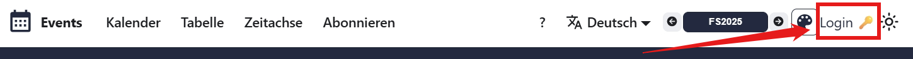

    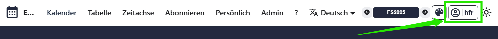

2. ### Persönlicher Bereich
    Eigene Termine findet man unter dem Menüpunkt __Persönlich__, dort können auch neue Termine erstellt werden.
    ![__Persönlich > :mdi[plus-circle-outline] Neuer Termin__ [👉 Neuen Termin erstellen](/user?user-tab=events&events-tab=my-events) --width=850px](./images/new-event.png)

3. ### Ansicht der Eingabemaske
    Die Eingabemaske öffnet sich und der Termin kann erfasst werden. Je nach Bildschirmgrösse wird die Eingabemaske direkt in der Zeile oder im Fenster angezeigt.
    
    <Tabs groupId="edit-mode">
        <TabItem value="row-mask" label="Zeilenmodus" default>
            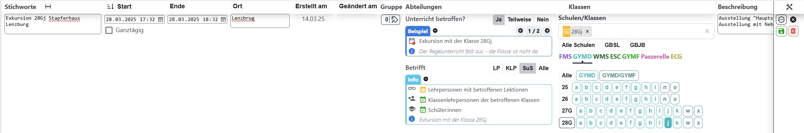

            

                

                    Ganz rechts in der Zeile kann über die Optionen __:mdi[dots-horizontal-circle-outline] > :mdi[arrow-expand-all] Öffnen__  in den Fenstermodus gewechselt werden.
                

                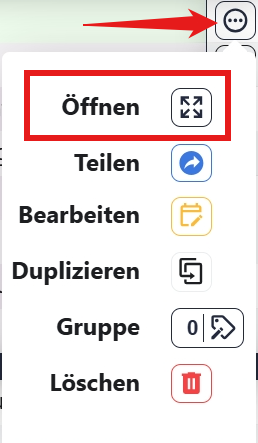
            

        </TabItem>
        <TabItem value="window-mask" label="Fenstermodus">
            
            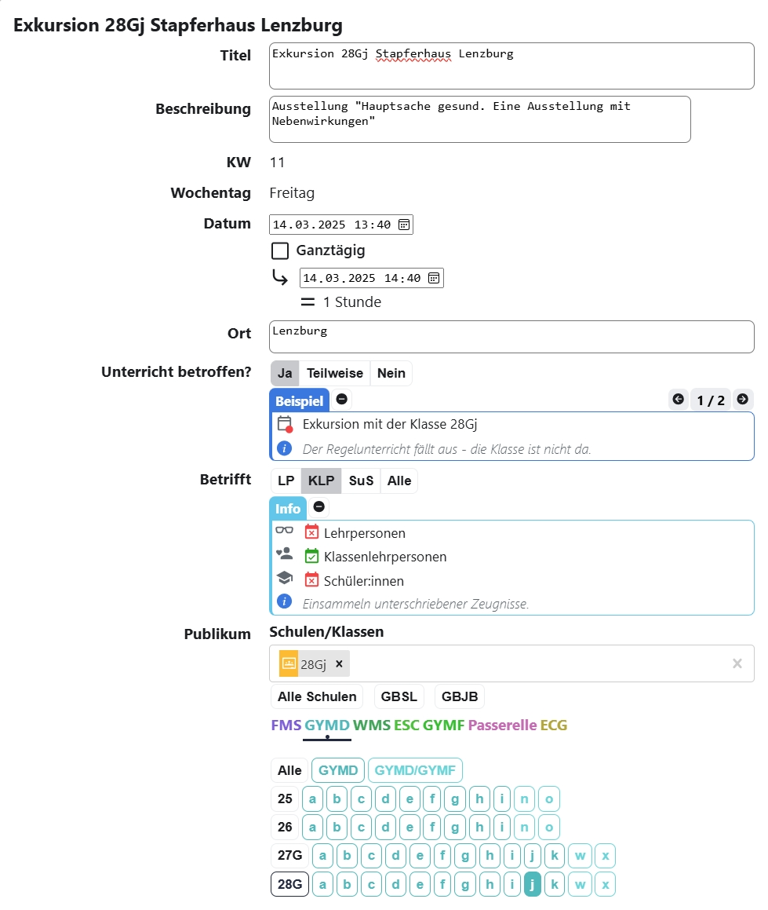
        </TabItem>
    </Tabs>

4. ### Termin erfassen

    - Alle wichtigen Termininformationen können nun erfasst werden.
    - Eine Beschreibung aller Felder ist [👉 weiter unten](#eingabemaske) zu finden.
    - Änderungen können über die Schaltfläche __:mdi[content-save]{.green} Speichern__ gespeichert werden. Ein Termin muss also nicht auf anhieb vollständig erfasst werden. Er kann gespeichert und zu einem späteren Zeitpunkt weiter bearbeitet werden.
        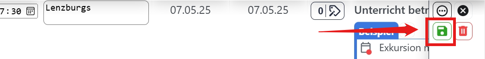
    
    :::warning[Speichern :mdi[not-equal-variant] Einreichen]
    Gespeicherte Termin-Entwürfe werden nicht automatisch veröffentlicht! Sie müssen im nächsten Schritt zur Überprüfung eingereicht werden. 
    :::
5. ### Zur Überprüfung einreichen
    Ein neuer Termin kann während einem [👉 offenen Eingabefenster](#eingabefenster) zur Überprüfung eingereicht werden. Eine Administrator\:in prüft und veröffentlicht den Termin. Erst nach der Veröffentlichung wird der Termin im Kalender angezeigt.

    <Tabs groupId="edit-mode">
        <TabItem value="row-mask" label="Zeilenmodus" default>
            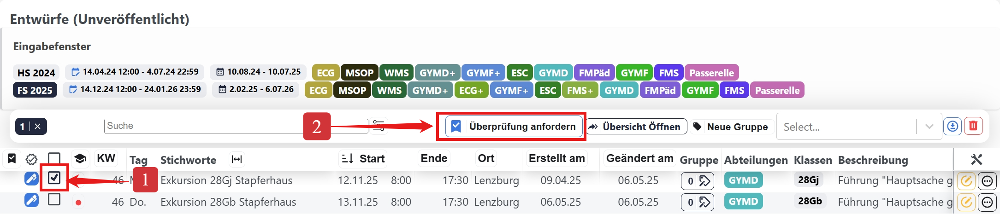
        </TabItem>
        <TabItem value="window-mask" label="Fenstermodus">            
                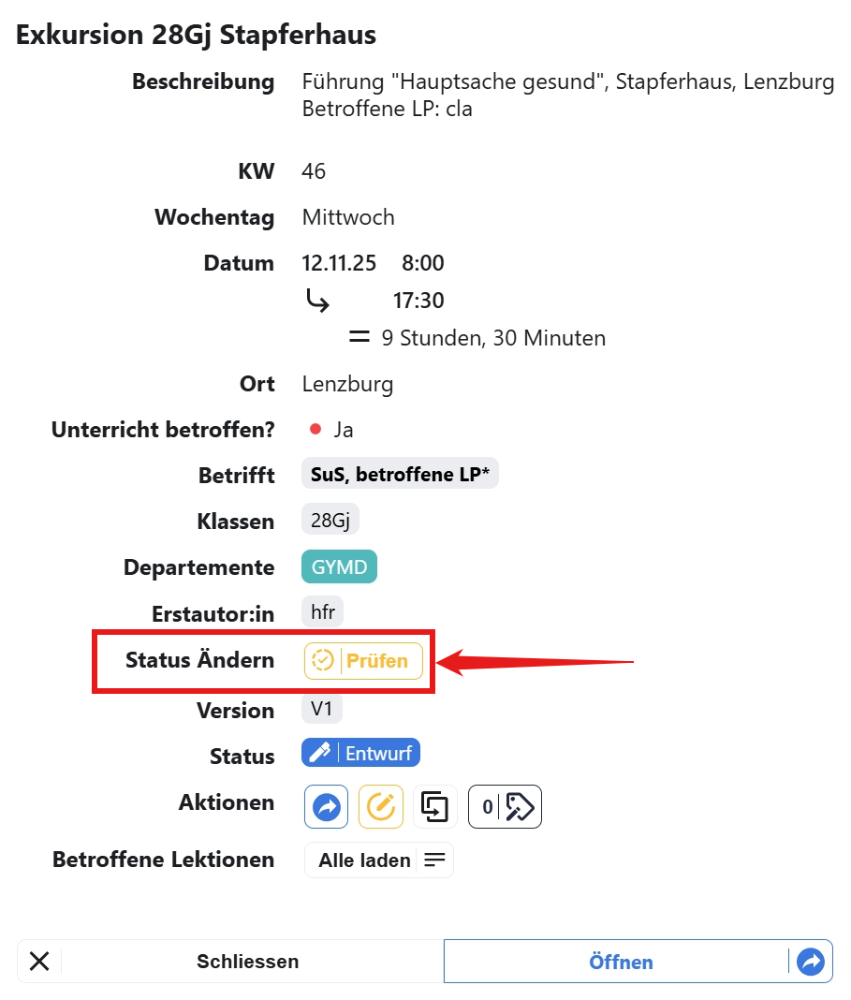
        </TabItem>
    </Tabs>

6. ### Kontrolle
    Nach dem Einreichen muss die finale Version nochmals auf Richtigkeit kontrolliert werden.

    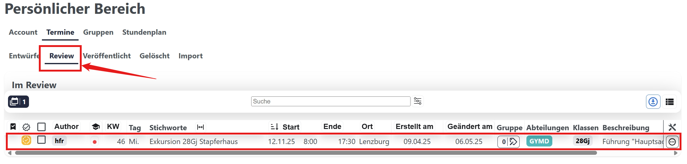

    

        

            Eingereichter Termin zurückziehen
        

        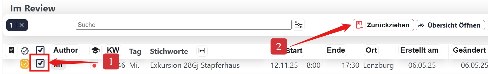
    

</Steps>

## Eingabemaske

### Felder

:::info[Pflichtfelder]
Die Felder __Titel__ und __Publikum__ sind Pflichtfelder.
:::

<Dl>
    <dt>Titel\*</dt>
    <dd>Kurze Beschreibung des Termins, in der Regel weniger als *80* Zeichen.</dd>
    <dt>Beschreibung</dt>
    <dd>Detaillierte Beschreibung des Termins. Kann auch mehrere Absätze enthalten.</dd>
    <dt>Start</dt>
    <dd>Datum und Uhrzeit, wann der Termin beginnt.</dd>
    <dt>Ende</dt>
    <dd>Datum und Uhrzeit, wann der Termin endet. Der Termin kann auch ganztägig sein.</dd>
    <dt>Ort</dt>
    <dd>Wo findet der Termin statt? Darf auch leer bleiben.</dd>
    <dt>Publikum\*</dt>
    <dd>
        Wer ist vom Termin betroffen?
    </dd>
    <dd>
        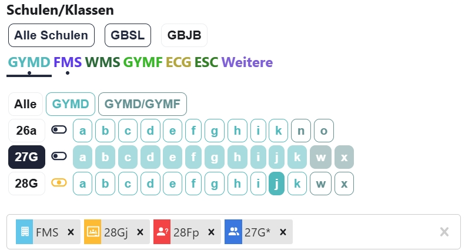
        Betrifft
        - :mdi[office-building]{.info} eine ganze Abteilung.
        - :mdi[google-classroom]{.orange} eine bekannte Klasse.
        - :mdi[account-question]{.red} eine künftige Klasse, die noch nicht in WebUntis geführt wird.
        - :mdi[account-multiple]{.blue} ein ganzer Klassenjahrgang. 

        :::danger[Eine Klasse wird nicht angezeigt?]
        - Überprüfen des **Datums**: Gibt es die Klasse zu diesem Zeitpunkt (noch) an der Schule?
        - Ist es eine **neue Klasse** und WebUntis zeigt die Klasse noch nicht an? Die Klasse [👉 manuell eingegeben](#künftige-klassen).
        :::
    </dd>
    <dt>Betrifft</dt>
    <dd style={{marginBottom: '1.2em 0'}}>
        <Badge text="interaktiv!" icon={mdiArrowDownThick} color="orange" iconSide="left" title="Klicke auf die verschiedenen Optionen um die betroffenen Gruppen anzuzeigen." />
        <AudienceOptionsField />
        Eine detailliertere Übersicht findet sich [👉 weiter unten](#betrifft).
    </dd>
    <dt>Unterricht betroffen?</dt>
    <dd>
        <Badge text="interaktiv!" icon={mdiArrowDownThick} color="orange" iconSide="left" title="Klicke auf die verschiedenen Optionen um die Beispiele anzuzeigen." />
        <TeachingAffectedField />
    </dd>
    <dt>Status</dt>
    <dd>
    Gibt an, ob der Termin veröffentlicht wurde oder nicht.
    </dd>
    <dd>
        <Badge 
            icon={EventStateButton.DRAFT}
            color={EventStateColor.DRAFT}
            title={EventStateTranslation.DRAFT}
            text={EventStateTranslation.DRAFT}
            iconSide='left'
            className={styles.badge}
        />  *Ein Termin, der noch nicht veröffentlicht wurde. Er ist nur für die Autor\:in sichtbar.*
    </dd>
    <dd>
        <Badge 
            icon={EventStateButton.REVIEW}
            color={EventStateColor.REVIEW}
            title={EventStateTranslation.REVIEW}
            text={EventStateTranslation.REVIEW}
            iconSide='left'
            className={styles.badge}
        /> *Ein Termin, der zur Überprüfung eingereicht wurde. Er ist nur für die Autor\:in und die Admins sichtbar.*
    </dd>
    <dd>
        <Badge 
            icon={EventStateButton.PUBLISHED}
            color={EventStateColor.PUBLISHED}
            title={EventStateTranslation.PUBLISHED}
            text={EventStateTranslation.PUBLISHED}
            iconSide='left'
            className={styles.badge}
        /> *Ein veröffentlichter Termin, der für alle sichtbar ist.*
    </dd>
    <dd>
        <Badge 
            icon={EventStateButton.REFUSED}
            color={EventStateColor.REFUSED}
            title={EventStateTranslation.REFUSED}
            text={EventStateTranslation.REFUSED}
            iconSide='left'
            className={styles.badge}
        /> *Ein Termin, der abgelehnt wurde. Ist nur für die Autor\:in und die Admins sichtbar.*
    </dd>
    <dd>
        :::warning[Veröffentlichte Termine]
        Ist ein Termin einmal veröffentlicht, so kann er nicht mehr direkt bearbeitet oder komplett gelöscht werden.
        - Gelöschte Termine werden in der Übersicht nicht mehr angezeigt, erscheinen aber weiterhin im abonnierten Kalender als gelöschter Termin.
        - Änderungen bei veröffentlichten Terminen führen stets zu einer neuen Version, wobei stets die aktuellste Version angezeigt wird.
        Anpassungen sind dadurch transparent nachvollziehbar.
        :::
    </dd>
</Dl>

\* Pflichtfelder, die zwingend eingetragen werden müssen.

### Betrifft
Schulische Termine betreffen __Lehrpersonen__, __Klassenlehrpersonen__, die __Schülerschaft__ oder __Alle__. Abhängig davon, für wen die Termine erfasst wurden und ob der stundenplanmässige Unterricht betroffen ist, werden sie im Terminplan angezeigt.

Die folgende Tabelle zeigt eine Übersicht, wann ein Termin für die verschiedenen Zielgruppen angezeigt wird.

<table className={styles.audience}>
	<tbody>
		<tr>
			<td rowSpan="2" className={styles.left}><b>Der Termin...</b></td>
			<td colSpan="4">wird angezeigt für:</td>
		</tr>
		<tr>
			<td colSpan="2">Lehrpersonen</td>
			<td rowSpan="2">KLP, der  betroffenen  Klasse</td>
			<td rowSpan="2">Schüler\:innen</td>
		</tr>
		<tr>
            <td className={styles.left}>...ist während der Lektion?\*</td>
			<td>Ja</td>
			<td>Nein</td>
		</tr>
		<tr className={styles.line}>
			<td className={styles.left}>...für __Alle__</td>
			<td>✅</td>
			<td>✅</td>
			<td>✅</td>
			<td>✅</td>
		</tr>
		<tr>
			<td className={styles.left}>...für Schüler\:innen __SuS__</td>
			<td>✅</td>
			<td>◻️</td>
			<td>✅</td>
			<td>✅</td>
		</tr>
		<tr>
			<td className={styles.left}>...für Lehrpersonen __LP__</td>
			<td>✅</td>
			<td>✅</td>
			<td>✅</td>
			<td>◻️</td>
		</tr>
		<tr>
			<td className={styles.left}>...für Klassenlehrpersonen __KLP__</td>
			<td>◻️</td>
			<td>◻️</td>
			<td>✅</td>
			<td>◻️</td>
		</tr>
	</tbody>
</table>

\* Wenn ein Termin während einer Lektion im Regelstundenplan stattfindet (auch, wenn er während der Lektion beginnt oder endet), wird er für betroffene Lehrpersonen angezeigt.

## Zur Überprüfung einreichen

Ein **neuer Termin** kann während einem offenen Eingabefenster zur Überprüfung eingereicht werden. Die Admins werden benachrichtigt und prüfen den Termin. Nach der Veröffentlichung wird der Termin im Kalender angezeigt.

### Eingabefenster

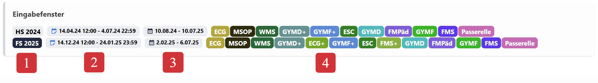

<Dl>
    <dt><Badge text="1" color="red" /></dt>
    <dd>Offene Eingabefenster sind schwarz hinterlegt.</dd>
    <dt><Badge text="2" color="red" /></dt>
    <dd>In dieser Zeitspanne können neue Termine zur Überprüfung eingereicht werden.</dd>
    <dt><Badge text="3" color="red" /></dt>
    <dd>Für diese Zeitspanne können die neuen Termine eingereicht werden.</dd>
    <dt><Badge text="4" color="red" /></dt>
    <dd>Eine dieser Abteilungen muss im eingereichten Termin vorkommen.</dd>
</Dl>

:::info[Festlegung der Eingabefenster]
Die Eingabefenster werden von der Administration festgelegt und wie bisher in einer Orientierung kommuniziert.
Ein Eingabefenster ist vom Start- bis zum Enddatum offen und ermöglicht in dieser Zeit, **neue Termine** einzureichen.
:::

:::tip[Terminänderungen]
Bei **fehlerhaften** Terminen oder **unvollständigen** Angaben (bspw. Zimmerzuteilungen) kann ein Änderungsantrag an die Admins gemacht werden. Diese prüfen den Antrag und veröffentlichen ggf. den aktualisierten Termin.
:::

## Künftige Klassen

Für Klassen oder Jahrgänge, die noch nicht in WebUntis geführt werden, können entsprechende Klassen bereits im Voraus hinterlegt werden.

:::info[Jahrgang]
Ein Klassenjahrgang betrifft alle Klassen eines ganzen Jahrgangs. Dies wird mit einem `*` angezeigt. Z.B. <Badge text="29G*" inline /> für alle 29er Klassen des Gymnasiums oder <Badge text="29F*" inline/> für alle 29er Klassen der FMS.
:::

<VideoGrid
    videos={[
        {
            src: require('./images/event-new-class.mp4').default,
            title: 'Zukünftige Klasse erfassen',
            autoplay: true,
            maxHeight: '300px',
            loop: true
        },
        {
            src: require('./images/event-new-class-group.mp4').default,
            title: 'Zukünftigen Jahrgang erfassen',
            autoplay: true,
            maxHeight: '300px',
            loop: true
        }
    ]}
/>
