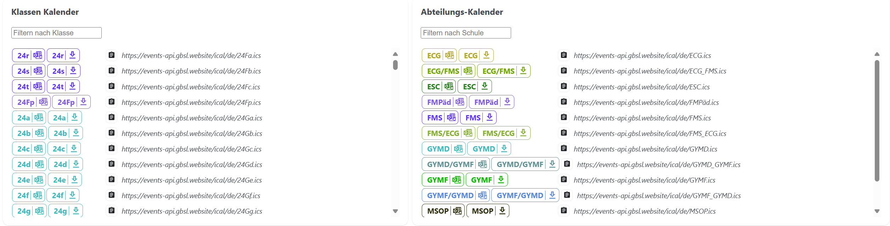

import Video from '@site/src/components/VideoGrid/Video';
import Tabs from '@theme/Tabs';
import TabItem from '@theme/TabItem';

# Abonnieren

Der Terminkalender kann auch in der persönlichen Kalenderanwendung (Outlook, iCalendar, Google Calendar) abonniert werden. So werden alle Termine automatisch in den eigenen Kalender übernommen.

:::tip[Automatische Aktualisierung]
Änderungen bei abonnierten Terminen werden automatisch übernommen (bis zu 12h Verzögerung).
:::

<Tabs>
  <TabItem value="outlook" label="Outlook" default>
    <Video
        src="/videos/Events-Abonnieren.mp4"
        title="Abonnieren"
    />
  </TabItem>
  <TabItem value="google" label="Google Calendar">
    <Video
        src="/videos/Events-Abonnieren-Google.mp4"
        title="Abonnieren Google Calendar"
    />    
  </TabItem>
  <TabItem value="apple" label="Apple iCalendar">
    <Video
        src="/videos/Events-Abonnieren-iCalendar.mp4"
        title="Abonnieren Apple iCalendar"
    />
  </TabItem>
</Tabs>

:::warning[Einzelne Termine Löschen]
Bei einem abonnierten Kalender können einzelne Termine nicht gelöscht oder verändert werden. Es ist aber angedacht, dass künftig einzelne Termine abbestellt werden können.
:::

## Abteilungs- oder Klassenkalender

Es ist auch möglich, nur die Termine einer Abteilung oder Klasse zu abonnieren. Dazu einfach die entsprechende Abteilung oder Klasse auswählen und den Kalender so wie oben beschrieben abonnieren.

