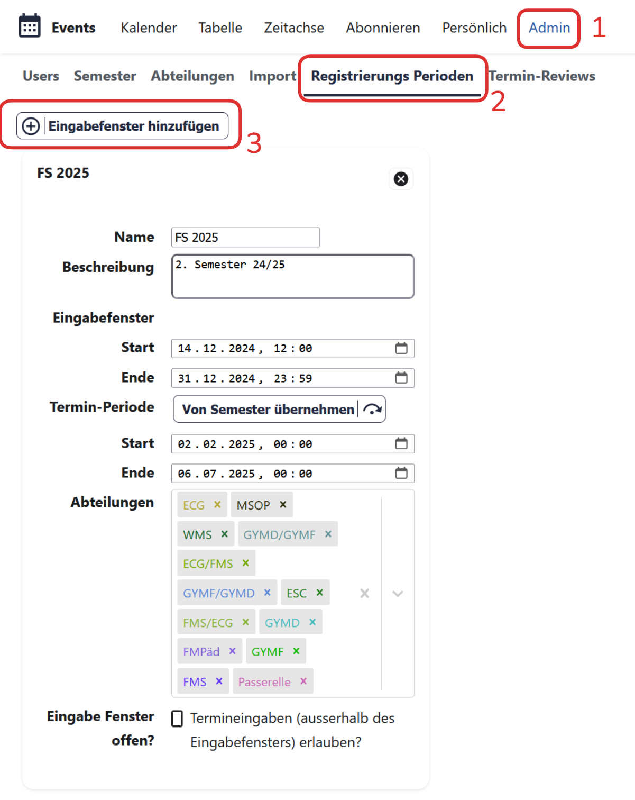

# Admins

## Registrierungsperiode erfassen

Name
: Semestername, wird oben rechts in der Navigation angezeigt.
Beschreibung
: Administrative Hinweise.
Eingabefenster
: Von wann bis wann dürfen Lehrpersonen ihre Termine zur Überprüfung einreichen?
Termin-Periode
: Lehrpersonen können nur Termine einreichen, die innerhalb dieses Zeitraums liegen.
Abteilungen
: Eingabefenster können auch nur für einzelne Abteilungen geöffnet werden.
Eingabefenster offen?
: Ist diese Option aktiv, so können unabhängig vom Eingabenfenster Termine für die angegebene Zeitspanne eingereicht werden.