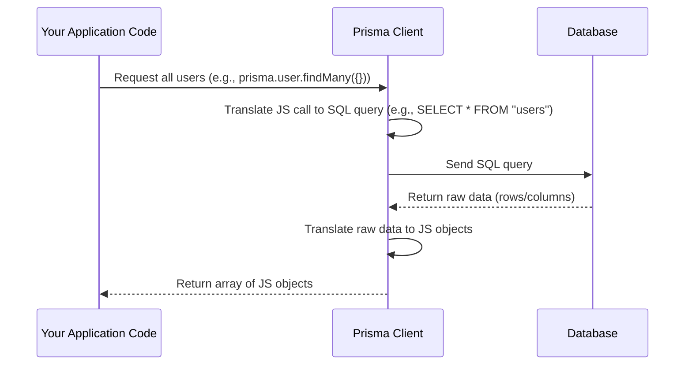

# Chapter 1: Database ORM (Prisma)

Welcome to the first chapter of the `events-api` tutorial! We're starting our journey by looking at how our application talks to the database. Think of the database as a big storage room where all the important information (like users, events, and other data) lives.

## Why Do We Need a Translator?

Imagine you speak English, and the database speaks a completely different language, let's call it "Database-nese" (which is actually SQL - Structured Query Language). To get information from the storage room or put new information in, you need a translator.

Directly writing and understanding "Database-nese" (SQL) can be complicated, especially for common tasks like getting a list of users, finding a specific event, or adding a new one.

This is where an **ORM** comes in. ORM stands for **Object-Relational Mapper**. It's like our special translator!

## Introducing Prisma: Our Database Translator

In our `events-api` project, we use **Prisma** as our ORM. Prisma acts as the translator between our JavaScript code and the database.

Instead of writing complex SQL queries, we can use friendly JavaScript objects and functions provided by Prisma. Prisma understands our data structure and knows how to communicate with the database for us.

Prisma handles the heavy lifting:
*   **Saving** new records to the database (like creating a new user).
*   **Retrieving** existing records (like getting a list of all events).
*   **Updating** records (like changing an event's description).
*   **Deleting** records (like removing a user account).

## The Database Blueprint: `schema.prisma`

How does Prisma know what kind of data we have (users, events, etc.) and how they relate to each other? It uses a **database schema definition**, which is like a blueprint or a map of our storage room.

In our project, this blueprint is defined in the `prisma/schema.prisma` file.

Let's look at a simplified version of this file, focusing on just the `User` data:

```prisma
generator client {
    provider        = "prisma-client-js"
    previewFeatures = ["postgresqlExtensions", "views"]
}

datasource db {
    provider   = "postgresql"
    url        = env("DATABASE_URL") // Tells Prisma where to find the database
    extensions = [pg_trgm, pgcrypto]
}

model User {
    id        String        @id @default(dbgenerated("gen_random_uuid()")) @db.Uuid // A unique ID for each user
    email     String        @unique // User's email, must be unique
    // ... other user details like name, roles etc.
    firstName String        @map("first_name") // Maps to a column named 'first_name' in the database
    // ... other fields
    events    Event[]       @relation("events") // A user can author multiple events
    // ... other relations and fields

    @@map("users") // Maps this 'User' model to a database table named 'users'
}

// ... other model definitions for Event, Department, etc.
```

*   `datasource db`: This section tells Prisma how to connect to our specific database (in this case, PostgreSQL, using a connection URL from our environment variables).
*   `generator client`: This section tells Prisma to generate the JavaScript code (the 'Prisma Client') that we will use in our application to interact with the database.
*   `model User`: This defines the structure for our "User" data. It lists all the fields (`id`, `email`, `firstName`, etc.) and their types (`String`, `DateTime`, etc.). It also defines relationships (`events Event[]`) and how this model maps to an actual database table (`@@map("users")`).

Prisma reads this file and generates code that allows us to work with `User`, `Event`, and other models as if they were simple JavaScript objects.

## Our First Use Case: Getting All Users

Let's consider a simple task: getting a list of all users stored in the database.

With Prisma, this task becomes very straightforward in our JavaScript code. We can use the generated Prisma Client.

The core part of getting all users using Prisma looks like this:

```ts
import prisma from '../src/prisma'; // Import the generated Prisma Client

async function getAllUsers() {
  // Use the 'prisma.user' object to interact with the 'User' data
  const allUsers = await prisma.user.findMany({}); // Find many users, with no filters (get all)
  return allUsers;
}

// Example of calling the function (outside this simple snippet)
// const users = await getAllUsers();
// console.log(users);
```

**Explanation:**

1.  `import prisma from '../src/prisma';`: We import a ready-to-use instance of the Prisma Client which is set up in `src/prisma.ts`.
2.  `await prisma.user.findMany({});`: This is the magic!
    *   `prisma`: The Prisma Client instance.
    *   `.user`: Refers to the `User` model we defined in `schema.prisma`.
    *   `.findMany({})`: This is a Prisma Client method that translates to "select multiple records". The empty `{}` means we don't have any specific conditions or filters, so it will find *all* user records.
    *   `await`: Since database operations take time, `findMany` returns a Promise, so we `await` the result.

The result of `prisma.user.findMany({})` will be an array of JavaScript objects, where each object represents a user from the database, structured according to the `User` model in our `schema.prisma` file.

You can see variations of this in the project code, for example, in `src\models\user.ts` which provides higher-level functions like `all()`, `findModel()`, `updateModel()`, etc., built *on top* of the basic Prisma Client calls.

Here's a simplified look at the actual `all` function in `src\models\user.ts`, showing how it uses `prisma.user.findMany`:

```ts
// Simplified src\models\user.ts (actual code is more complex with type handling, etc.)
import prisma from '../src/prisma';
import { User } from '@prisma/client'; // Prisma generates types too!

function Users(db: typeof prisma.user) { // 'db' here is basically prisma.user
    return Object.assign(db, {
        async all(): Promise<User[]> { // Function to get all users
            // This is the core Prisma call to get all users
            const models = await db.findMany({});
            // The actual code then does some data preparation (prepareUser)
            // but the essential database interaction is here
            return models // Simplified: just return the models for now
        },
        // ... other functions like findModel, updateModel, etc.
    });
}

export default Users(prisma.user); // Export the Users object which uses prisma internally
```

And in `src\controllers\users.ts`, you'll find the web server code that uses this `all` function from `src\models\user.ts`:

```ts
// Simplified src\controllers\users.ts (actual code includes req, res, next, error handling, etc.)
import Users from '../models/user'; // Import the Users object from our model file

// This function is called when a web request asks for all users
async function handleGetAllUsersRequest() {
     // Call the 'all' function defined in src/models/user.ts
    const users = await Users.all();
    return users; // Return the array of user objects
}
```
We will explore Controllers ([Request Handlers (Controllers)](05_request_handlers__controllers__.md)) and Models ([Data Logic (Models)](02_data_logic__models__.md)) in later chapters. For now, just know that the web server uses functions that ultimately rely on Prisma to get data from the database.

## Under the Hood: How Prisma Translates

So, what happens when you call `prisma.user.findMany({})`? Let's trace the steps:

Imagine ordering food at a restaurant:

1.  **User Code (You):** You decide you want "All the users". You tell your "waiter".
2.  **Prisma Client (`src/prisma.ts`):** This is the waiter. It receives your request (`findMany({})` on the `User` model).
3.  **Prisma Client (Translation):** The waiter mentally translates your request into Kitchen Language (SQL). "OK, user wants all `User` records. That translates to `SELECT * FROM "users";` in Database-nese."
4.  **Database (The Kitchen):** The waiter sends the SQL query to the database server.
5.  **Database (Execution):** The chef (database) understands Database-nese. It finds the `"users"` table and retrieves all rows (`SELECT *`).
6.  **Database (Response):** The chef gives the results back to the waiter. This data is in a raw, structured format (like rows and columns).
7.  **Prisma Client (Translation Back):** The waiter receives the raw data. It looks at the `schema.prisma` blueprint to understand the structure and translates the raw database rows and columns back into familiar JavaScript objects (like `{ id: '...', email: '...', firstName: '...', ... }`).
8.  **Prisma Client (Delivers Result):** The waiter gives you (your JavaScript code) the nicely formatted array of JavaScript objects.

Here's a simple sequence diagram illustrating this flow:



This translation process happens automatically every time you use the Prisma Client methods (`findMany`, `findUnique`, `create`, `update`, `delete`, etc.). This allows you to focus on writing JavaScript logic rather than dealing with the specifics of SQL and different database systems.

## Conclusion

In this chapter, we learned that interacting with a database in a large application can be complex. Prisma acts as a vital ORM, simplifying database operations by translating between our JavaScript code and the database's language (SQL). We saw how the `prisma/schema.prisma` file defines our data structure and how the generated Prisma Client (`src/prisma.ts`) allows us to perform common tasks like fetching data (`findMany`) using simple JavaScript calls.

Prisma is a powerful tool, but how does our application structure the *logic* around fetching and modifying data? This leads us to the concept of Data Logic or "Models", which we'll explore next.

[Next Chapter: Data Logic (Models)](02_data_logic__models__.md)

---

Generated by [AI Codebase Knowledge Builder](https://github.com/The-Pocket/Tutorial-Codebase-Knowledge)
