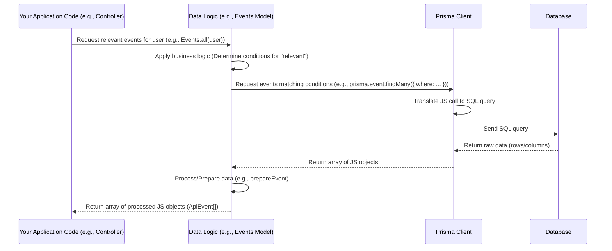

# Chapter 2: Data Logic (Models)

Welcome back! In our last chapter, we met Prisma, our trusty translator that helps our JavaScript code talk to the database ([Database ORM (Prisma)](01_database_orm__prisma__.md)). Prisma is great for basic tasks like "find a user by ID" or "create a new event record".

But what about more complicated requests? Like:

*   "Show me *all* the events that are relevant *to this specific user*, including their drafts and any public events?"
*   "Create a new department, but first, check that the combination of its letter code and class letters hasn't been used before?"

These aren't just simple database operations; they involve specific business rules or complex combinations of data. If we put all this logic directly wherever we need it (for instance, in the code that handles incoming web requests, which we'll call "Controllers" later), things would quickly get messy and hard to manage.

## Why We Need Expert Workers

Imagine the database is a vast archive storehouse, and Prisma is the clerk who knows how to find and file individual documents based on specific instructions (like "Find document with ID 'X'" or "File this new `Event` document").

Now, imagine someone asks for "all documents related to Project Alpha that are approved *and* were created this month". The clerk *could* figure this out, but it would require many steps: Find all documents for Project Alpha, then filter those by approval status, then filter those again by creation date. If this kind of request happens often, the clerk could become a bottleneck, and we'd have to repeat these complex instructions every time.

This is where **Models** come in. Think of Models as **expert workers**, each specializing in a specific type of data (like User Expert, Event Expert, Department Expert).

*   They know all the complex rules and logic related to their data type.
*   They know *how* to use the database clerk (Prisma) to perform the necessary steps.
*   Other parts of the application (like our Controllers) don't need to know the intricate details of how the data is fetched, filtered, or validated. They just ask the relevant Model: "Hey Event Expert, give me all events for User X."

Models encapsulate this **Data Logic** – the rules and operations that define how we interact with and manipulate our data beyond simple storage and retrieval.

## The Core Idea: Models Use Prisma Internally

In our `events-api` project, Models are typically implemented as modules (files like `src/models/event.ts`, `src/models/user.ts`, etc.) that export an object with functions representing the operations for that data type. Internally, these functions use the Prisma Client we learned about in Chapter 1 to actually talk to the database.

So, the flow isn't: Controller -> Prisma -> Database.
It's: Controller -> **Model** -> Prisma -> Database.

The Model acts as a layer of abstraction, hiding the database interaction details and providing higher-level functions.

## Our Use Case: Getting Events for a User

Let's take our use case: "Show me all the events that are relevant *to this specific user*, including their drafts and any public events."

From the perspective of the part of the application that needs this information (say, a component building a user's dashboard), they just need to call a function that does this. Without Models, this code would have to:
1.  Use Prisma to find all published events (state is `PUBLISHED`).
2.  Use Prisma again to find all events authored by the user (regardless of state).
3.  Manually combine these lists, removing duplicates.

With a Model, this logic is hidden inside the `Events` Model. The code needing this data simply calls a dedicated function on the `Events` Model object.

Here's what that might look like from the "outside" (e.g., in a Controller, which we'll cover in [Request Handlers (Controllers)](05_request_handlers__controllers__.md)):

```ts
// This is a simplified example from where you might use a Model
import Events from '../models/event'; // Import the Events Model

async function getUserEvents(user: { id: string }) {
  console.log(`Fetching all relevant events for user ID: ${user.id}`);

  // Call the specific function on the Events Model
  const userEvents = await Events.all(user);

  console.log(`Found ${userEvents.length} events.`);
  return userEvents; // This will be an array of event objects
}

// In a real controller, `user` would come from the request context
// For example: const events = await getUserEvents(req.user);
```

**Explanation:**

*   We import the `Events` object from the `src/models/event.ts` file.
*   We call the `all()` function on the `Events` object, passing the `user` object.
*   The `all()` function encapsulates the logic for determining which events are relevant to that user. We don't see or care about the specific Prisma queries needed; the Model handles it.

This makes the code that *uses* the Model much cleaner and easier to understand.

## Under the Hood: How the `Events` Model Works

How does this magical `Events.all(user)` function actually work? Let's peek inside the `src/models/event.ts` file.

The `Events` model is constructed using the Prisma Client instance (`prisma.event`) tailored for the `Event` data.

```ts
// Simplified src\models\event.ts (actual code includes security checks, helpers, etc.)
import prisma from '../prisma';
import { Event, EventState, Role, User } from '@prisma/client';
// ... other imports and helper functions like prepareEvent ...
import { prepareEvent, ApiEvent } from './event.helpers';
import { rmUndefined } from '../utils/filterHelpers'; // Helper for cleaning query filters

function Events(db: typeof prisma.event) { // 'db' is the Prisma client for the Event model
    return Object.assign(db, {
        // ... other methods like findModel, updateModel, createModel ...

        async all(actor?: User | undefined): Promise<ApiEvent[]> {
            // If no user is provided, just return published events
            if (!actor) {
                return this.published(); // Uses another Model function, also uses Prisma
            }

            const isAdmin = actor.role === Role.ADMIN;

            // Use Prisma to find events based on complex conditions
            const events = await db.findMany({
                include: { departments: true, children: true }, // Include related data
                where: {
                    // This is the core business logic implemented using Prisma's filter syntax
                    AND: rmUndefined([
                        // Condition 1: Exclude published parent events (they are fetched separately by `this.published()`)
                        // The logic here prevents duplicates in the combined list
                        {
                            NOT: {
                                AND: [{ state: EventState.PUBLISHED }, { parentId: null }]
                            }
                        },
                        {
                            // Condition 2: Match events where the user is the author OR the state is REVIEW/REFUSED (if admin)
                            // This gets the user's own non-published events + admin-specific events
                            OR: rmUndefined([
                                { authorId: actor.id }, // User is the author
                                isAdmin ? { state: EventState.REVIEW } : undefined, // Admins see review events
                                isAdmin ? { state: EventState.REFUSED } : undefined // Admins see refused events
                                // Note: Real code also checks user groups for read access
                            ])
                        }
                    ])
                },
                orderBy: { start: 'asc' } // Sort the results
            });

            // Call another function to prepare the data for the API response
            const userSpecificEvents = events.map(prepareEvent);

            // Combine user-specific events with published events (fetched by this.published())
            // The actual `all` function in the source code calls `this.published(semesterId)` first,
            // then `this.forUser(actor)`, and combines the results. Let's simplify for the example:
            // return [...(await this.published()), ...userSpecificEvents]; // Simplified combination

             // For this basic example just return the specific ones
             return userSpecificEvents;

        },

        // ... other functions like published, forUser, createModel, cloneModel, etc.
    });
}

export default Events(prisma.event); // Create and export the Events model object
```

**Explanation:**

1.  `function Events(db: typeof prisma.event) { ... }`: This defines the factory function that creates our `Events` model object. It receives the specific Prisma Client instance for the `Event` model (`prisma.event`).
2.  `Object.assign(db, { ... })`: We are essentially adding our custom methods (`all`, `findModel`, `updateModel`, etc.) to the basic Prisma Client `db` object. This gives us both the low-level Prisma methods *and* our higher-level business logic methods on the same `Events` object.
3.  `async all(actor?: User | undefined): Promise<ApiEvent[]> { ... }`: This is the function we called from our example Controller code. It takes an optional `actor` (the user making the request).
4.  `await db.findMany({...})`: Inside our Model function, we see the Prisma Client being used (`db` is the `prisma.event` instance).
5.  `where: { AND: [ ... ] }`: This is where the *Data Logic* lives! The `where` clause contains the complex conditions translated into Prisma's query language: get events that (A) are not published parents, AND (B) are either authored by the `actor` OR (if the `actor` is an admin) are in `REVIEW` or `REFUSED` state.
6.  `events.map(prepareEvent)`: After getting the raw data from Prisma, the Model uses a helper function (`prepareEvent`) to format the data structure into the desired `ApiEvent` format before returning it. This is another common task for Models – ensuring the data is shaped correctly for other parts of the application.

This demonstrates how the `Events` Model encapsulates the specific rules ("what events are relevant to a user?") and uses Prisma to execute the necessary database query.

## Another Example: Department Uniqueness

Models also handle validation and relationships. Look at `src/models/department.ts`. The `updateModel` function in this file doesn't just call `prisma.department.update`. It first performs complex checks, like calling `invalidLetterCombinations` (defined in `src/models/department.helpers.ts`) to ensure that the main letter and class letters combination for a department is unique across all other departments.

```ts
// Simplified snippet from src\models\department.ts
async updateModel(actor: User, id: string, data: Prisma.DepartmentUncheckedUpdateInput) {
    // ... authorization check ...

    const sanitized = getData(data);

    // --- Business Logic/Validation handled by the Model ---
    // Check for unique letter combinations using a helper function
    const invalidLetters = await invalidLetterCombinations(sanitized, id);
    if (invalidLetters.length > 0) {
        throw new HTTP400Error(/* ... error message ... */);
    }
    // Check for valid department relationships
    // ... logic checking department1_Id and department2_Id relations ...
    if (/* ... invalid relationship condition ... */) {
         throw new HTTP400Error(/* ... error message ... */);
    }
    // --- End Business Logic ---

    // Only *then* use Prisma to perform the actual database update
    const model = await db.update({
        where: { id: id },
        data: sanitized
    });
    return model;
}
```

This shows that Models contain validation rules and business processes, not just data fetching logic.

## The Flow with Models Included

Let's update our sequence diagram from Chapter 1 to include the Model layer.



This diagram illustrates that the Model layer is where requests are interpreted according to application rules *before* they become simple database operations handled by Prisma.

## Conclusion

Models are crucial for organizing the Data Logic in our `events-api` project. They act as expert intermediaries between the high-level application code (consumers of data, like future Controllers) and the low-level database interaction layer (Prisma). By encapsulating business rules, validation, and complex queries within Models, we keep our codebase organized, maintainable, and easier to understand.

Instead of asking Prisma directly for every data fetch or change, other parts of the application ask the relevant Model to perform tasks like `Events.all(user)` or `Departments.updateModel(...)`. The Model then knows how to use Prisma and apply the necessary logic.

Now that we understand how we manage and interact with data logic using Models and Prisma, we are ready to look at how our application receives incoming requests from the outside world!

[Next Chapter: API Web Server (Express.js)](03_api_web_server__express_js__.md)

---

Generated by [AI Codebase Knowledge Builder](https://github.com/The-Pocket/Tutorial-Codebase-Knowledge)
