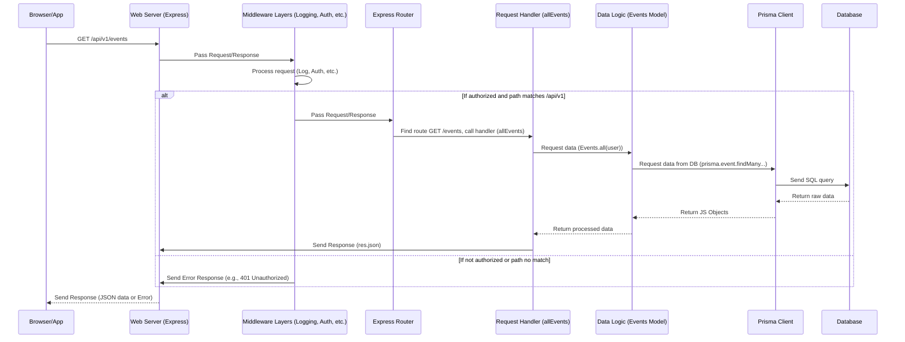

# Chapter 3: API Web Server (Express.js)

Welcome back! In the first two chapters, we explored how our application stores data using Prisma ([Database ORM (Prisma)](01_database_orm__prisma__.md)) and how we organize the data-related logic within Models ([Data Logic (Models)](02_data_logic__models__.md)). These pieces handle the "behind-the-scenes" work with our database.

But how does the outside world – a user browsing a website or another application – actually *tell* our `events-api` to perform tasks like "get all events" or "create a new department"?

This is where the **API Web Server** comes in.

## The Application's Front Door

Imagine our `events-api` project is like an office building containing different departments (the Models, the Prisma archive room, etc.). People outside the building (users, other apps) need a way to interact with it. They can't just walk directly into the Prisma archive room!

They need a clear channel for communication, a "front door" or a "receptionist" who:

1.  **Listens:** Stands ready to receive incoming requests.
2.  **Receives:** Takes the request (like "I'd like to get a list of all public events").
3.  **Understands:** Figures out *what* the person is asking for and *where* they want to go. ("Okay, they want the list of events, that's handled by the Events department.").
4.  **Directs:** Sends the request to the correct department or expert worker within the building for processing.
5.  **Sends Back:** Receives the result from the department ("Here's the list of events") and sends it back to the person who asked for it.

Our API Web Server plays this exact role. It's the engine that runs constantly, listening for inbound communication over the internet (HTTP requests), processing them, and sending back responses.

## Introducing Express.js: Our Receptionist

In the `events-api` project, we use **Express.js** as our web server framework. Express is a popular, minimalist framework for Node.js that makes it easy to build web applications and APIs. It provides the tools to handle the receptionist's tasks: listening, routing, and managing the flow of requests.

Think of Express as setting up our office building's front desk and internal mail system.

## How Express Works (Simplified)

Let's break down the core functions Express handles in our project:

### 1. Listening for Requests

Our application needs to start up and tell the computer to wait for incoming connections on a specific "port" number (like a phone extension).

This happens in `src/server.ts`:

```ts
// Simplified src\server.ts
import app from './app'; // Our Express application instance
import http from 'http';
import Logger from './utils/logger';

const PORT = process.env.PORT || 3002; // The port number the server will listen on

const server = http.createServer(app); // Create an HTTP server using our Express app

// Start the server and make it listen on the specified port
server.listen(PORT || 3002, () => {
    Logger.info(`application is running at: http://localhost:${PORT}`);
    Logger.info('Press Ctrl+C to quit.');
});

// ... rest of the file setting up Socket.IO, etc.
```

**Explanation:**

*   We import the `app` instance, which is our configured Express application object.
*   We create a standard Node.js HTTP server using `http.createServer` and pass our Express `app` to it. Express basically acts as the handler for this server.
*   `server.listen(PORT, ...)` is the command that tells the server to start listening on the specified port (commonly 3002 in development). From this moment on, it's ready to receive requests!

### 2. Requests and Responses (`req` and `res`)

When a request arrives (e.g., from your web browser fetching data), Express automatically creates two important objects for us:

*   `req` (Request): Contains all the information about the incoming request. This includes:
    *   The URL the user is trying to access (e.g., `/api/v1/events`).
    *   The HTTP method used (e.g., `GET`, `POST`, `PUT`).
    *   Any data sent in the request body (e.g., details for creating a new event).
    *   Information about the user's browser, cookies, etc.
*   `res` (Response): An object we use to build and send the response back to the user. We can use methods like:
    *   `res.status(200)`: Set the HTTP status code (e.g., 200 for success).
    *   `res.send('OK')`: Send a simple text response.
    *   `res.json({...})`: Send a JSON response (very common for APIs like ours).

These `req` and `res` objects are the standard way we interact with incoming requests and send responses in Express handlers.

### 3. Routing: Directing the Request

The receptionist doesn't send *every* request to the same place. They look at *what* is being requested and then direct it. In Express, this is called **Routing**. Routing is the process of determining how an application responds to a client request to a particular endpoint, which is a URL path (like `/events` or `/users`) and a specific HTTP method (`GET`, `POST`, etc.).

In `events-api`, the core routing is defined in `src/routes/router.ts`. Requests typically come in with a prefix `/api/v1/`, which is handled slightly earlier in `src/app.ts`.

Let's look at a simplified piece of `src/app.ts` and `src/routes/router.ts`:

```ts
// Simplified src\app.ts
import express from 'express';
// ... other imports like middleware ...
import router from './routes/router'; // Our main router
// ... other imports ...

const app = express(); // Create the main Express application instance

export const API_VERSION = 'v1';
export const API_URL = `/api/${API_VERSION}`; // Defines the common API prefix

// ... middleware setup (like express.json(), session, passport) ...

// This line tells Express to use our 'router' for any requests
// that start with the API_URL prefix (e.g., /api/v1/...)
app.use(
    `${API_URL}`,
    (req, res, next) => { /* ... authentication logic ... */ next(); },
    (req, res, next) => { /* ... authorization logic via routeGuard(AccessRules) ... */ next(); },
    router // Attach the router here
);

// ... error handling middleware ...

export default app; // Export the app for src/server.ts to use
```

```ts
// Simplified src\routes\router.ts
import express from 'express';
import {
    all as allEvents, // This is the function that handles GET /events
    create as createEvent
    // ... other event controller functions ...
} from '../controllers/events'; // Functions that handle specific requests are often called 'controllers'

// Initialize an Express Router instance
const router = express.Router();

// Define a route:
// When a GET request comes in for '/events',
// call the `allEvents` function.
// Remember, this router is already mounted under /api/v1 by app.ts,
// so the full path is /api/v1/events
router.get('/events', allEvents);

// Another example:
// When a POST request comes in for '/events',
// call the `createEvent` function.
router.post('/events', createEvent);

// ... many other routes defined here ...

export default router; // Export the router
```

**Explanation:**

*   In `src/app.ts`, we create the main `app` and specify that for any path starting with `/api/v1`, Express should hand over control to our `router` object *after* applying some middleware (we'll get to that next).
*   In `src/routes/router.ts`, we define specific routes on the `router` instance. `router.get('/events', allEvents)` tells Express: "If the request is a `GET` request and the *rest* of the path (after `/api/v1`) is `/events`, then execute the `allEvents` function".

The `allEvents` function (and others like `createEvent`) contains the code logic to actually *do* something with the request, like fetching data from the database via a Model. These functions are often called **Request Handlers** or **Controllers**, and we'll discuss them fully in [Request Handlers (Controllers)](05_request_handlers__controllers__.md).

### 4. Middleware: Processing Layers

The receptionist might have various quick tasks to perform before or after sending a request to a department. Maybe they log every incoming request, check if the visitor has an appointment (authentication), or make sure they understand who they are speaking to (session management).

In Express, this is handled by **Middleware**. Middleware are functions that have access to the `req` and `res` objects and the `next()` function in the application's request-response cycle. They can:

*   Execute any code.
*   Make changes to the request and the response objects.
*   End the request-response cycle.
*   Call the next middleware function in the stack.

Middleware functions are like layers that the request passes through on its way to the final route handler. They are typically applied using `app.use()` or `router.use()`.

Look again at the snippet from `src/app.ts`:

```ts
// from src\app.ts
// ... other imports ...
import morganMiddleware from './middlewares/morgan.middleware'; // Our logging middleware
import router from './routes/router'; // Our main router
// Authentication and Authorization middleware (Passport, routeGuard)
import passport from 'passport';
import routeGuard, { createAccessRules } from './auth/guard';
import authConfig from './routes/authConfig';
// Session middleware setup (simplified)
import session from 'express-session';
// JSON body parsing middleware
import express from 'express' // already imported

const app = express();
const AccessRules = createAccessRules(authConfig.accessMatrix);

// --- Examples of Middleware ---

// Middleware 1: Enable CORS (allows requests from different origins)
app.use(cors({ /* ... config ... */ }));

// Middleware 2: Parse incoming JSON request bodies
app.use(express.json());

// Middleware 3: Log incoming requests
app.use(morganMiddleware);

// Middleware 4 & 5: Setup session and passport for authentication
app.use(session(/* ... config ... */));
app.use(passport.initialize());
app.use(passport.session());

// Middleware & Router: For paths starting /api/v1:
app.use(
    `${API_URL}`, // The path this segment of middleware/router applies to
    (req, res, next) => { /* isAuthenticated logic using passport */ next(); }, // Authentication check
    routeGuard(AccessRules), // Authorization check using our guardian
    router // Our main router (if request passes previous middleware)
);

// ... other app logic ...
```

**Explanation:**

*   `app.use(cors(...))`: This middleware adds special headers to the response to allow web pages from other domains to talk to our API.
*   `app.use(express.json())`: This essential middleware intercepts incoming requests with JSON data in the body, parses it, and makes it available on `req.body`. Without this, `req.body` would be undefined!
*   `app.use(morganMiddleware)`: As seen in `src/middlewares/morgan.middleware.ts`, this middleware logs details about every incoming HTTP request (method, URL, status, response time) to the console.
*   `app.use(session(...))` and `app.use(passport.initialize())`, `app.use(passport.session())`: These middlewares are part of setting up user sessions and authentication, allowing the server to remember who a user is across multiple requests. We'll cover authentication more in [Access Control (Authentication & Authorization)](04_access_control__authentication___authorization__.md).
*   The middlewares applied specifically to the `API_URL` (`/api/v1`) handle authentication (checking if the user is logged in) and authorization (checking if the logged-in user has permission to access the specific path and method, using `routeGuard` based on `AccessRules`).

Middleware forms a pipeline. A request arrives, passes through `cors`, then `express.json`, then `morganMiddleware`, then session/passport middleware, and then if the path starts with `/api/v1`, it hits the authentication, authorization (`routeGuard`), and finally, if authorized, the `router` to find the *specific* route handler.

## Walking Through a Request: `GET /api/v1/events`

Let's trace what happens when a browser or client application sends a `GET` request to `http://your-api-url/api/v1/events`:

1.  **Server Receives:** The `server.listen` in `src/server.ts` detects an incoming request on the specified port.
2.  **Express Takes Over:** The request is handed to our Express `app` instance.
3.  **Middleware Pipeline:** The request starts passing through the middleware defined in `src/app.ts`:
    *   `cors` processes (adds headers).
    *   `express.json` processes (finds no JSON body for a GET request, but is ready if there was one).
    *   `morganMiddleware` logs the request line (`GET /api/v1/events ...`).
    *   `session` and `passport` process (look for session cookie, try to identify the user - this is crucial before authorization).
    *   The path `/api/v1/events` matches the ``app.use(`${API_URL}`, ...)`` block.
    *   The authentication middleware checks if `req.isAuthenticated()` is true based on the session/passport work.
    *   Assuming the user is authenticated, the `routeGuard(AccessRules)` middleware checks if this user's role/identity has permission to perform a `GET` request on `/api/v1/events` according to the rules defined in `authConfig`.
4.  **Routing:** If the request passes the middleware (especially the `routeGuard`), it reaches the `router`. The `router` looks for a definition that matches `GET /events` (relative to its mount path `/api/v1`). It finds `router.get('/events', allEvents);`.
5.  **Handler/Controller Executed:** The `allEvents` function from `src/controllers/events.ts` is called. This function receives the `req` and `res` objects.
6.  **Data Logic (Model):** Inside `allEvents`, it will likely call `await Events.all(req.user)`, using the Model we discussed in [Data Logic (Models)](02_data_logic__models__.md).
7.  **Database Interaction (Prisma):** The `Events.all()` Model function uses Prisma client methods like `prisma.event.findMany(...)` ([Database ORM (Prisma)](01_database_orm__prisma__.md)) to query the database.
8.  **Response Built:** The database results go back to the Model, potentially processed, then returned to the `allEvents` handler/controller. The controller then uses `res.json(...)` to format the data as JSON and sends it back.
9.  **Response Sent:** The response travels back through any *post*-processing middleware (none explicitly shown here, but possible) and eventually back over the internet to the client that made the request.

## Under the Hood: The Flow

Here's a simple sequence diagram showing the journey of that `GET /api/v1/events` request through the layers we've discussed and will discuss:



This diagram illustrates how Express acts as the central point, receiving the request and orchestrating its journey through middleware for processing before it reaches the specific code (the Controller -> Model -> Prisma) designed to fulfill the request's purpose.

## Conclusion

The API Web Server, powered by Express.js in our project, is the essential component that makes our `events-api` accessible from the internet. It constantly *listens* for requests, *routes* them to the correct handling code based on the URL and method, and manages a pipeline of *middleware* to perform common tasks like logging, processing request bodies, handling user sessions, and most importantly, checking who the user is and if they are allowed to do what they are asking.

While the web server receives and directs, the actual decision of *whether* a user is allowed to access a specific resource is a critical responsibility that often happens within the middleware layer before the request even reaches the final handler. This is the concept of Access Control, which we will explore in the next chapter.

[Next Chapter: Access Control (Authentication & Authorization)](04_access_control__authentication___authorization__.md)

---

Generated by [AI Codebase Knowledge Builder](https://github.com/The-Pocket/Tutorial-Codebase-Knowledge)
