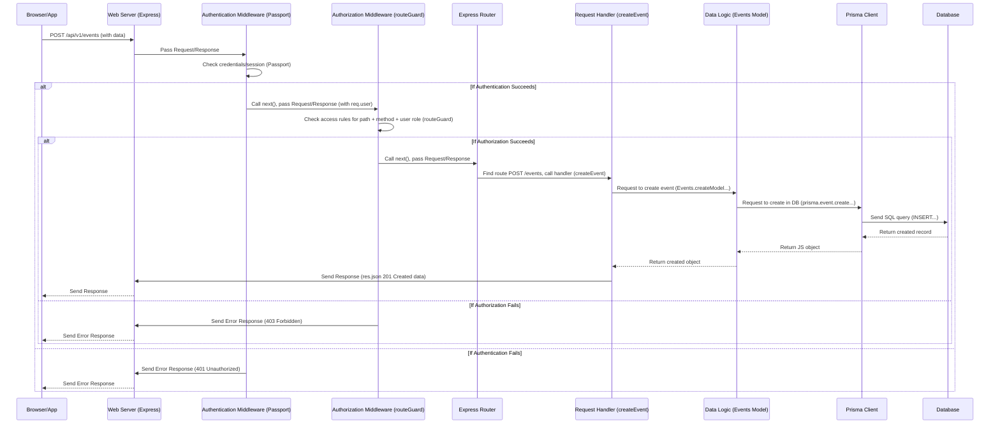

# Chapter 4: Access Control (Authentication & Authorization)

Welcome back! In the previous chapter, [API Web Server (Express.js)](03_api_web_server__express_js__.md), we learned how our `events-api` uses Express.js as its front door to receive requests from the outside world (like users or other applications). Express listens for requests, routes them to the right place, and uses middleware for initial processing like logging or parsing data.

Express is great at *receiving* requests, but it doesn't automatically know *who* is making the request or *what* they should be allowed to do. When someone asks to, say, "create a new event," how do we know they're registered? And even if they are, are they allowed to create *any* event, or only certain types?

This is where **Access Control** comes in. It's about protecting our API's resources and functionality.

## The Security Guard Analogy

Think about our API building again. Express is the receptionist. But we also need security:

1.  **Authentication (The Security Guard at the Entrance):** This is the process of verifying *who* someone is. It's like showing your ID badge to the guard at the building entrance. They check your ID against a list or system to confirm you are who you say you are.

    *   *Question it answers:* "Who are you?"
    *   *Example:* A user logs in with an email and password (or via a service like Microsoft/Azure AD, as used in this project). The API verifies these credentials.
    *   *Result:* If successful, the API knows the user's identity (e.g., their unique ID, their name, their email).

2.  **Authorization (The Access Card/Rules for Different Rooms):** Once the security guard at the entrance knows *who* you are, authorization checks *what* you are allowed to do and access *within* the building. It's like your ID badge (or access card) having different permissions – maybe it lets you into the archive room, but not the manager's office, or maybe it only lets you *read* documents in the archive, but not *write* new ones.

    *   *Question it answers:* "What are you allowed to do?"
    *   *Example:* An authenticated user tries to create a new event. The API checks if users with their role (e.g., `USER`, `ADMIN`) have permission to perform a `POST` request on the `/events` path.
    *   *Result:* If authorized, the user can proceed with their request. If not, the request is denied.

In our `events-api` project, Access Control combines Authentication and Authorization to ensure:
*   Only known users can access certain parts of the API (Authentication).
*   Known users can only perform actions they are permitted to do based on their role and the specific resource (Authorization).

## Our Use Case: Controlling Who Can Create Events

Let's use a simple, concrete example: **Creating a new event.**

*   A regular user (`Role.USER`) should be able to *create* events they are involved in or author.
*   An administrator (`Role.ADMIN`) should also be able to create events.
*   Someone who is *not logged in* (an anonymous or 'PUBLIC' user) should *not* be able to create events.

So, when a `POST` request arrives at the `/api/v1/events` path, we need to:
1.  Check if the requester is authenticated (logged in). If not, deny access.
2.  If authenticated, check if their role (`USER` or `ADMIN`) is allowed to make a `POST` request to `/api/v1/events`. If not, deny access.

This check needs to happen *before* the code that actually creates the event in the database is executed.

## Access Control in the Server Pipeline

Remember the middleware pipeline in `src/app.ts` from Chapter 3? This is where our Access Control steps are placed.

The request goes through several middleware functions *before* reaching the specific Request Handler (Controller) that fulfills the request's purpose (`allEvents` or `createEvent`, etc.). Authentication and Authorization middleware are key parts of this pipeline.

Here's a simplified look at the relevant part of `src/app.ts` again:

```ts
// Simplified src\app.ts - Focusing on Authentication and Authorization Middleware
import express from 'express';
// ... other imports like cors, express.json, morganMiddleware ...

// Passport is used for Authentication (Who are you?)
import passport from 'passport';

// routeGuard is used for Authorization (What are you allowed to do?)
import routeGuard, { createAccessRules } from './auth/guard';
import authConfig from './routes/authConfig'; // Defines the rules

import router from './routes/router'; // The router with specific handlers

const app = express();
export const API_URL = `/api/v1`; // Our API prefix

// Load access rules from authConfig
const AccessRules = createAccessRules(authConfig.accessMatrix);

// ... other general middleware (cors, express.json, morganMiddleware, session) ...
app.use(passport.initialize()); // Initialize passport authentication
app.use(passport.session());    // Enable passport to use sessions

// Authentication and Authorization are applied to routes under /api/v1
app.use(
    `${API_URL}`,
    // --- Authentication Step ---
    (req, res, next) => {
        // If user is already authenticated (e.g., from session), proceed
        if (req.isAuthenticated()) {
            return next();
        }
        // Otherwise, try to authenticate using the configured strategy (like OAuth/Azure AD)
        passport.authenticate('oauth-bearer', { session: true }, (err, user, info) => {
             if (err || !user) {
                 // If authentication fails, send 401 Unauthorized response
                 return res.status(401).json({ error: err ? err.message : "Unauthorized" });
             }
             // If authentication succeeds, attach the user to the request
             req.user = user;
             // Authentication passed, move to the next middleware (Authorization)
             next();
        })(req, res, next); // This part is a bit advanced Express, just know it runs the authentication logic
    },
    // --- Authorization Step ---
    routeGuard(AccessRules), // Check if the authenticated user is allowed to access this route
    // --- If both pass, proceed to the Router ---
    router // Handles the specific request (e.g., calling the createEvent controller)
);

// ... error handling middleware ...

export default app;
```

**Explanation:**

1.  `app.use(passport.initialize())` and `app.use(passport.session())`: These lines set up the Passport library, which handles the Authentication step. Passport is configured elsewhere (`src/auth/index.ts`, `src/auth/azure-ad.ts`, `src/auth/mock.ts`) to understand *how* to verify a user (e.g., by checking credentials or tokens). If successful, Passport attaches information about the authenticated user to the request object, typically as `req.user`.
2.  The first function inside ``app.use(`${API_URL}`, ...)`` is our custom authentication check using Passport. It tries to authenticate the user. If it fails (no user found or an error), it stops the request and sends a `401 Unauthorized` response. If successful, it calls `next()` to move to the next middleware.
3.  `routeGuard(AccessRules)`: This is the Authorization middleware. It's called *only if* the user was successfully authenticated in the previous step (or if the route is public like `GET /events`). It uses the `AccessRules` (loaded from `authConfig.ts`) to check if the authenticated user (`req.user`) has the *required role* to access the requested *path* using the requested *HTTP method* (`POST` for `/events` in our use case).
4.  If `routeGuard` determines the user is *not* authorized, it stops the request and sends a `403 Forbidden` response.
5.  If `routeGuard` determines the user *is* authorized, or if the route is explicitly public (like fetching all public events via `GET /events`), it calls `next()`, and the request finally proceeds to the `router`, which will then call the appropriate Request Handler (Controller) like `createEvent`.

This middleware setup ensures that every request targeting the `/api/v1` routes is subjected to Authentication and Authorization checks *before* the core logic for that route is accessed.

## Under the Hood: How `routeGuard` Authorizes

Let's dive a bit deeper into how `routeGuard` works, specifically looking at `src/auth/guard.ts` and `src/routes/authConfig.ts`.

The core of authorization is the `AccessRules` object, which acts like a master list of permissions. It's generated from the `accessMatrix` defined in `src/routes/authConfig.ts`.

Here's a simplified look at `src/routes/authConfig.ts`:

```ts
// Simplified src\routes\authConfig.ts - Defines Access Rules
import { Role } from '@prisma/client'; // Roles are defined by Prisma based on our schema

export interface AccessMatrix {
    [key: string]: {
        path: string; // The API path (can include parameters like :id)
        access: {
            methods: ('GET' | 'POST' | 'PUT' | 'DELETE')[]; // Allowed methods for this rule
            roles: Role[]; // Roles that are allowed for these methods and path
        }[];
    };
}

const authConfig: { accessMatrix: AccessMatrix, /*...*/ } = {
    accessMatrix: {
        // Rule for seeing if a user is logged in
        checklogin: {
            path: '/checklogin',
            access: [
                { methods: ['GET'], roles: [Role.ADMIN, Role.USER] } // Both ADMIN and USER can GET this
            ]
        },
        // Rule for accessing/creating/updating/deleting events
        event: {
            path: '/events', // Applies to /api/v1/events and /api/v1/events/:id
            access: [
                { methods: ['GET'], roles: [Role.ADMIN, Role.USER] }, // ADMIN and USER can GET (list/find) events
                { methods: ['POST', 'PUT', 'DELETE'], roles: [Role.ADMIN, Role.USER] } // ADMIN and USER can POST, PUT, DELETE events
                // Note: The User role might have further checks *within* the Controller/Model
                // for *which specific* event they can modify (their own, etc.).
                // The routeGuard checks the *general* permission for the path/method.
            ]
        },
        // Rule for modifying user roles (only admins)
        userSetRole: {
            path: '/users/:id/set_role', // Specific path for changing roles
            access: [
                { methods: ['PUT'], roles: [Role.ADMIN] } // ONLY ADMIN can PUT to this path
            ]
        }
        // ... many other rules for different paths ...
    },
    // ... other config like credentials, metadata, settings ...
};

export default authConfig;
```

**Explanation:**

*   The `accessMatrix` defines rules based on `path` and the actions (`methods`) allowed for different `roles`.
*   Under the `event` key, the `path: '/events'` entry covers both the list endpoint (`/events`) and the detail endpoint (`/events/:id`) due to how `routeGuard` matches paths.
*   It specifies that `GET` is allowed for both `ADMIN` and `USER` roles.
*   It also specifies that `POST`, `PUT`, and `DELETE` are allowed for both `ADMIN` and `USER` roles. (As noted in the comment, finer-grained "Can user X edit event Y?" checks still happen in the Model/Controller, but the `routeGuard` gives the initial permission based on role and path/method).
*   Contrast this with `userSetRole`: only `ADMIN` is listed for the `PUT` method on that specific path.

Now, let's see (simplified) how `routeGuard` in `src/auth/guard.ts` uses these rules:

```ts
// Simplified src\auth\guard.ts - The routeGuard logic
import type { Role } from '@prisma/client';
import { Request, Response, NextFunction } from 'express';
import { HttpStatusCode } from '../utils/errors/BaseError';
// AccessRules is the processed version of the matrix from authConfig
import { createAccessRules, PUBLIC_ROUTES } from '../routes/authConfig';

// ... helper functions like createAccessRules and regexFromRoute ...

const routeGuard = (accessMatrix: any /* Simplified: it's Array<AccessRegexRule> */) => {
    // This inner function IS the middleware called by Express *after* Authentication
    return (req: Request, res: Response, next: NextFunction) => {
        const reqPath = req.path.toLowerCase();
        const reqMethod = req.method as 'GET' | 'POST' | 'PUT' | 'DELETE';
        const user = req.user as { role?: Role } | undefined; // Get the authenticated user (or undefined if not)

        // --- Check 1: Allow Public GET requests ---
        // Some routes are public (like GET /events to see published events).
        // We check if the path is in the list of public routes OR matches a public regex route.
        const isPublicGet = reqMethod === 'GET' &&
                            (PUBLIC_ROUTES.includes(reqPath) || /* checks against regex for :id paths */);
        if (isPublicGet) {
           // If it's a public GET route, allow it even if user is not logged in
           // Note: The actual data returned for public GETs might be filtered later by the Model
           return next();
        }

        // --- Check 2: Require Authentication for Non-Public Routes ---
        // If it's not a public GET route, the user *must* be authenticated.
        if (!user || !user.role) {
            // If no user is attached to the request (means authentication failed or didn't happen for non-public route)
            return res.status(HttpStatusCode.FORBIDDEN).json({ error: 'Authentication required' });
        }

        // --- Check 3: Authorization based on Role and Access Rules ---
        // User is authenticated. Now check if their role has permission for this path and method.
        const isAuthorized = requestHasRequiredAttributes(accessMatrix, reqPath, reqMethod, user.role);

        if (isAuthorized) {
            // User is authorized! Proceed to the next middleware (likely the router/controller)
            next();
        } else {
            // User is authenticated but NOT authorized for this specific action
            return res.status(HttpStatusCode.FORBIDDEN).json({ error: 'User does not have required role or permission' });
        }
    };
};

/**
 * Simplified helper function to check if the user's role is allowed
 * for this path and method according to the access matrix.
 */
const requestHasRequiredAttributes = (
    accessMatrix: any, // Simplified type
    path: string,
    method: string,
    userRole: Role
): boolean => {
    // Find the specific rule in the accessMatrix that matches the requested path
    // (This involves regex matching for paths with parameters like :id - simplified here)
    const accessRule = accessMatrix.find( /* logic to find matching rule for path */); // Simplified

    // If no rule is found for this path, deny access by default (could also be a 404 error)
    if (!accessRule) {
        return false;
    }

    // Check if the user's role is present in the allowed roles list
    // for the requested method within the found access rule.
    const hasPermission = accessRule.access.some(
        (rulePart: any) => // Simplified type inside access array
            rulePart.roles.includes(userRole) && // Does this rule part include the user's role?
            rulePart.methods.includes(method)   // Does this rule part include the requested method?
    );

    return hasPermission;
};

export default routeGuard;
```

**Explanation:**

1.  `routeGuard` is the middleware function called by Express. It receives the `req`, `res`, and `next` objects.
2.  It first checks if the request is for a `GET` request on a publicly allowed path (`isPublicGet`). If so, it calls `next()` immediately, bypassing the authentication/authorization checks for logged-in users.
3.  If it's *not* a public GET, it checks if `req.user` exists and has a `role`. If not, authentication failed or wasn't performed for a non-public route, so it sends a `403 Forbidden` (or `401` in the `app.ts` middleware) response.
4.  If authentication passed, it calls `requestHasRequiredAttributes`, passing the loaded `accessMatrix`, the requested `path`, `method`, and the `user.role`.
5.  `requestHasRequiredAttributes` looks up the specific rule defined in `authConfig` that best matches the requested path.
6.  It then checks if that rule allows the user's `role` to perform the requested `method`.
7.  Based on the result, `routeGuard` either calls `next()` (authorized) or sends a `403 Forbidden` response (authenticated but not authorized).

This layered approach means that for our "create event" use case (`POST /api/v1/events`):
*   First, the authentication middleware checks if the user is logged in (`req.isAuthenticated()`, using Passport). If not, `401 Unauthorized`.
*   If logged in, `req.user` is available.
*   The `routeGuard` middleware is called. It sees it's a `POST` request (not a public GET). It checks if the user is authenticated (`req.user`). Yes.
*   It then calls `requestHasRequiredAttributes` with `req.path='/events'`, `req.method='POST'`, and `userRole` (either `USER` or `ADMIN`).
*   `requestHasRequiredAttributes` looks up the `/events` rule in the access matrix. It finds the entry `{ methods: ['POST', 'PUT', 'DELETE'], roles: [Role.ADMIN, Role.USER] }`.
*   It checks if the user's role (`USER` or `ADMIN`) is in `[Role.ADMIN, Role.USER]` and if the method `POST` is in `['POST', 'PUT', 'DELETE']`. Both are true for either `USER` or `ADMIN`.
*   `requestHasRequiredAttributes` returns `true`.
*   `routeGuard` receives `true` and calls `next()`.
*   The request proceeds to the `router` and the `createEvent` controller.

If an anonymous user (no `req.user`) tried `POST /api/v1/events`, the authentication middleware would fail and send `401 Unauthorized`. If a logged-in user with a different role (e.g., a hypothetical `VIEWER` role *not* in `[Role.ADMIN, Role.USER]` for the POST method) tried it, `requestHasRequiredAttributes` would return `false`, and `routeGuard` would send `403 Forbidden`.

## The Flow with Access Control

Let's update our sequence diagram to include the Authentication and Authorization steps.



This diagram clearly shows that Authentication and Authorization are crucial gates that the request must pass through *before* it gets to the code responsible for carrying out the requested action (Controller, Model, Prisma, DB).

## Conclusion

Access Control, divided into Authentication (proving who you are) and Authorization (checking what you can do), is fundamental to securing our `events-api`. With Express.js, we implement this as middleware layers that process every request before it reaches the core business logic. Passport handles the initial authentication, identifying the user and attaching their information to the request. Our custom `routeGuard` middleware then uses a defined set of `AccessRules` (`authConfig.ts`) to determine if the authenticated user's role is permitted to access the specific path and HTTP method requested. If either authentication or authorization fails, the request is stopped early, preventing unauthorized actions. Only if both checks pass does the request continue down the pipeline to the functional code that handles the request, which we call Request Handlers or Controllers.

Now that we've covered how requests are received, processed by middleware (including security checks), and directed, we're ready to look at the specific code that actually *handles* these requests and uses our Models to interact with the data.

[Next Chapter: Request Handlers (Controllers)](05_request_handlers__controllers__.md)

---

Generated by [AI Codebase Knowledge Builder](https://github.com/The-Pocket/Tutorial-Codebase-Knowledge)
