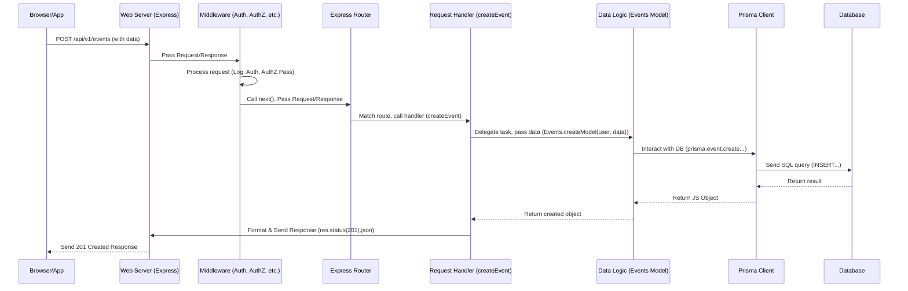

# Chapter 5: Request Handlers (Controllers)

Welcome back! In our last chapter, [Access Control (Authentication & Authorization)](04_access_control__authentication___authorization__.md), we saw how our application uses the Express.js web server ([API Web Server (Express.js)](03_api_web_server__express_js__.md)) and its middleware pipeline to receive requests, identify *who* is making the request (Authentication), and check *if* they are allowed to perform the requested action (Authorization).

So, a request comes in, Express receives it, middleware checks its validity and the user's permissions. What happens *after* these checks pass? The request has been verified and is ready to be processed for its actual purpose – like getting a list of events or creating a new department.

This is job of the **Request Handlers**, often referred to as **Controllers**.

## The Department Heads

Let's return to our office building analogy.

*   [Express.js](03_api_web_server__express_js__.md) is the Receptionist who receives all incoming visitors (requests).
*   Middleware (including [Authentication & Authorization](04_access_control__authentication___authorization__.md)) is the Security Guard who checks IDs and permissions at the entrance.
*   [Models](02_data_logic__models__.md) are the Expert Workers (like the "Event Expert" or "User Expert") who know how to deal with specific types of data and interact with the archive ([Prisma](01_database_orm__prisma__.md)).

Who connects the approved visitors (requests) to the correct Expert Worker (Model) and makes sure the task gets done? That's the **Department Head** or **Manager**.

In our `events-api`, the **Request Handlers (Controllers)** are these managers. They are the specific functions that Express's router ([API Web Server (Express.js)](03_api_web_server__express_js__.md)) directs the request to once it knows *what* the request is asking for and that the user is allowed to ask for it.

Their main job is to:

1.  **Receive** the incoming request (which has already passed authentication and authorization).
2.  **Understand** the specific action needed (e.g., "find event by ID", "create new department").
3.  **Delegate** the core task to the appropriate **Model** ([Data Logic (Models)](02_data_logic__models__.md)), providing any necessary information from the request (like user ID, event data from the body, or a record ID from the URL).
4.  **Format** the result received back from the Model (or handle errors).
5.  **Send** the final response back to the client using the `res` object.

They don't contain the detailed business logic (that's the Models') nor do they handle infrastructural tasks like parsing JSON or checking auth (that's the middleware's). They are the conductors, orchestrating the flow for a specific request.

## Our Use Case: Handling the "Create Event" Request

Let's stick with our example from the previous chapter: **Creating a new event**.

We know that a `POST` request to `/api/v1/events` arrives, passes through middleware (logging, parsing, authentication, authorization), and is then matched by the Express router to a specific function. That function is the Controller function responsible for *creating events*.

Where do these functions live? They are organized in files within the `src/controllers` directory, typically one file per major data type (e.g., `src/controllers/events.ts`, `src/controllers/users.ts`, `src/controllers/departments.ts`).

In `src/controllers/events.ts`, you'll find a function named `create`. This is the function our router ([API Web Server (Express.js)](03_api_web_server__express_js__.md)) points to for incoming `POST /events` requests.

## Looking at an Example: `src\controllers\events.ts` `create` function

Let's simplify the actual `create` function from `src/controllers/events.ts` to see its core structure:

```ts
// Simplified src\controllers\events.ts - create function
import { RequestHandler } from 'express'; // Import Express type
// ... other imports needed by the controller ...
import Events from '../models/event'; // Import the Events Model

// This function handles POST requests to /api/v1/events
export const create: RequestHandler = async (req, res, next) => {
    // 1. Get necessary data from the request
    // The request body (req.body) contains the data for the new event.
    // Middleware (like express.json) has already parsed this into a JS object.
    const { start, end } = req.body;

    // We know the user is authenticated and authorized because middleware ran before this!
    // The authenticated user is available on req.user
    const user = req.user!; // The '!' tells TypeScript user is definitely here

    try {
        // 2. Delegate the core task to the appropriate Model
        // Call the createModel function on the Events Model, passing the user and event data.
        const event = await Events.createModel(user, start, end);

        // 3. & 4. Format and Send the response
        // Set the HTTP status code to 201 (Created)
        res.status(201);
        // Send the created event object back as a JSON response
        res.json(event);

        // The actual code also adds notifications here for Socket.IO, which we'll cover later.
        // res.notifications = [...];

    } catch (e) {
        // If any error occurs during the process (e.g., database error, Model validation error)
        // Pass the error to the next middleware (our error handling middleware)
        next(e);
    }
};
```

**Explanation:**

1.  `export const create: RequestHandler = async (req, res, next) => { ... }`: This defines an asynchronous function named `create` and types it as an Express `RequestHandler`. `RequestHandler` is a type definition provided by Express to clarify that this function expects three parameters: `req` (the Request object), `res` (the Response object), and `next` (a function to call to pass control to the next middleware or error handler).
2.  `const { start, end } = req.body;`: It accesses the `body` of the incoming request (`req.body`). Express middleware like `express.json()` (which we saw in [API Web Server (Express.js)](03_api_web_server__express_js__.md)) automatically parses the JSON body of the request and makes it available as a JavaScript object here. We're extracting `start` and `end` date/time for the new event from this body.
3.  `const user = req.user!;`: It accesses the `user` object previously attached to the request by the [Authentication & Authorization](04_access_control__authentication___authorization__.md) middleware (specifically Passport). The Controller needs to know *who* is creating the event, as this information is often required by the Model (e.g., to set the event's author).
4.  `const event = await Events.createModel(user, start, end);`: **This is the core delegation step.** The Controller doesn't contain the complex logic for inserting an event into the database or performing related actions. Instead, it calls the `createModel` function on the `Events` Model ([Data Logic (Models)](02_data_logic__models__.md)). It passes the authenticated `user` and the necessary event data (`start`, `end`) to the Model. The `await` keyword is used because creating data in the database takes time, and the Model function returns a Promise.
5.  `res.status(201).json(event);`: If the Model successfully creates the event, the Controller receives the resulting event object back. It then uses the `res` (Response) object to construct and send the final HTTP response:
    *   `res.status(201)` sets the HTTP status code to 201, which means "Created". This is the standard success code for resource creation.
    *   `res.json(event)` formats the `event` object into a JSON string and sends it back to the client.
6.  `catch (e) { next(e); }`: This is standard Express error handling. If anything goes wrong within the `try` block (e.g., the Model throws an error because the data was invalid, or a database connection fails), the `catch` block catches the error and calls `next(e)`. This passes the error down the middleware pipeline to Express's built-in error handler, or our custom error handling middleware, which will format an appropriate error response (like a 400 or 500 status code).

This simplified example demonstrates that the Controller for `create` acts as a thin layer that translates the incoming HTTP request (get data from body, identify user) into a clear instruction for the relevant Model ("create an event for this user with this start/end time").

## What Happens Inside Other Controllers?

Controllers for other API endpoints follow a similar pattern:

*   **`GET /api/v1/events` (all)**: In `src/controllers/events.ts`, the `all` function likely calls `Events.published()` or `Events.all(req.user)`. It then sends the result using `res.json()`.
*   **`GET /api/v1/events/:id` (find)**: The `find` function takes `:id` from `req.params.id`, calls `Events.findModel(req.user, req.params.id)`, and sends the found event via `res.json()`.
*   **`PUT /api/v1/departments/:id` (update)**: The `update` function in `src/controllers/departments.ts` gets the ID from `req.params.id`, the update data from `req.body.data`, calls `Departments.updateModel(req.user!, req.params.id, req.body.data)`, and sends the updated department via `res.json()`.
*   **`DELETE /api/v1/users/:id` (destroy)**: The `destroy` function in `src/controllers/users.ts` gets the ID from `req.params.id`, calls `Users.destroy(req.user!, req.params.id)`, and typically sends a `204 No Content` status back if successful (`res.status(204).send()`).

You can look at the other controller files (`src/controllers/*.ts`) linked in the code snippets section to see many more examples of this pattern. Each exported function in these files is a Request Handler (Controller) for a specific route registered in `src/routes/router.ts`.

## The Flow with Request Handlers

Let's revisit the sequence diagram from the previous chapter, focusing on the Controller's place in the flow for our "Create Event" example (`POST /api/v1/events`):



This diagram clearly shows the Controller receiving the request *after* middleware and routing, then interacting with the Model to perform the actual data operation, and finally using the Server/Express to send the response back.

## Conclusion

Request Handlers or Controllers are the layer in our Express application responsible for the final step of processing an incoming request *after* it has passed through authentication and authorization middleware. They are the specific functions mapped by the router to different API endpoints (URL path + HTTP method).

Their key role is to extract necessary information from the request (`req`), delegate the core business logic to the appropriate Model ([Data Logic (Models)](02_data_logic__models__.md)), handle the Model's response or any errors, and format the final HTTP response (`res`) to be sent back to the client. They act as the coordination point between the web server layer and the application's data logic layer.

We now have a solid understanding of how requests come into the API, get secured, and are then directed to specific code that uses our data Models and Prisma to interact with the database. But what about data that doesn't come directly from client requests? Our application also needs to get data from external systems automatically.

[Next Chapter: External Data Sync](06_external_data_sync_.md)

---

Generated by [AI Codebase Knowledge Builder](https://github.com/The-Pocket/Tutorial-Codebase-Knowledge)
