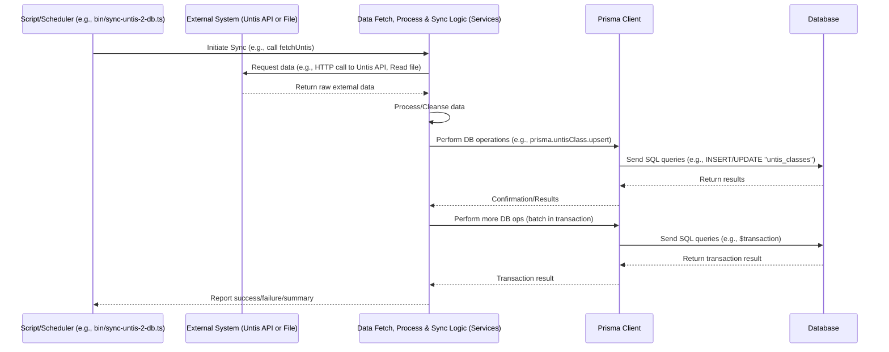

# Chapter 6: External Data Sync

Welcome back! So far, we've explored how our `events-api` handles incoming requests from the "outside world" – think of a user clicking a button in a web application. We saw how Express.js receives the request ([API Web Server (Express.js)](03_api_web_server__express_js__.md)), middleware secures it ([Access Control (Authentication & Authorization)](04_access_control__authentication___authorization__.md)), Controllers direct it ([Request Handlers (Controllers)](05_request_handlers__controllers__.md)), and Models and Prisma interact with the database ([Data Logic (Models)](02_data_logic__models__.md), [Database ORM (Prisma)](01_database_orm__prisma__.md)). This is the core flow for user-initiated actions.

But what about data that doesn't come from a user clicking a button? Our application needs to know about things like accurate class timetables, teacher lists, and potentially old event data stored in other systems. This information changes over time and needs to be updated in our database somehow. It would be impractical (and prone to errors) for a person to manually enter or update all this every time it changes.

## The Automated Courier Service

Imagine our application's database is a library's catalog. User requests are like librarians looking up specific books or adding new ones based on patron requests.

External Data Sync is like having an **automated courier service** that regularly visits other libraries (external systems like the Untis school system or old file archives), collects updated lists of books, new arrival lists, or corrections to existing entries, and brings them back to our library to update our catalog.

This process runs independently of individual user requests. Its main goals are:

*   **Fetch Data:** Retrieve information from outside sources.
*   **Process Data:** Clean, format, and maybe transform the data to fit our database structure.
*   **Sync Database:** Add new records, update existing ones, or mark old ones as inactive based on the external data, using tools like [Prisma](01_database_orm__prisma__.md).

In our `events-api` project, this external data comes mainly from:

1.  **Untis:** A school administration system containing timetables, teachers, classes, etc. This data needs to be synced regularly.
2.  **Legacy Import Files:** Old CSV or Excel files containing historical event data that needs to be imported once (or occasionally updated if the source files change).

## Our Use Case: Getting Untis Timetables into the Database

Let's focus on syncing data from the Untis system. The `events-api` needs to show accurate information about classes, teachers, and which lessons are happening, especially because events might affect teaching periods. This data is managed in Untis.

So, our use case for External Data Sync is: **Synchronize timetable, class, and teacher data from the Untis system into the `events-api` database.**

This needs to happen automatically, perhaps daily or weekly.

## How External Data Sync Works (Not via API Requests)

Unlike the API flow we saw earlier, syncing external data typically happens through:

*   **Standalone Scripts:** Programs that can be run manually or automatically by a scheduler.
*   **Background Jobs:** Tasks that run in the background without blocking the main web server. (We'll cover how these are managed in the next chapter, [Background Task Runner (Bree)](07_background_task_runner__bree__.md)).

These processes don't wait for an incoming HTTP request. Instead, they are triggered by a cron job, a manual command, or a background task runner.

Let's look at the scripts that initiate these sync operations. In the `events-api` project, you'll find scripts in the `bin` directory for this purpose.

Here's a simplified look at `bin/sync-untis-2-db.ts`, the script for syncing Untis data:

```ts
// Simplified bin\sync-untis-2-db.ts
import { fetchUntis } from '../src/services/fetchUntis'; // Imports the function to fetch data from Untis
import { syncUntis2DB } from '../src/services/syncUntis2DB'; // Imports the function to process and update DB

// This function runs when the script is executed
const main = async () => {
    // ... code to get the date for syncing and find the semester ...
    const semesterId = 'some-semester-id'; // Example
    console.log('Starting Untis sync for semester', semesterId);

    // 1. Fetch data from Untis
    const untisData = await fetchUntis(semesterId); // Pass semester info

    // 2. Process fetched data and update the database
    await syncUntis2DB(semesterId, untisData);

    console.log('Untis sync finished.');
};

// Execute the main function
main().catch((err) => console.error(err));
```

**Explanation:**

*   This is a simple Node.js script that can be run from the command line (e.g., `yarn untis:sync 2023-01-01`).
*   It imports two main functions: `fetchUntis` (responsible for communicating with the external Untis API) and `syncUntis2DB` (responsible for taking the fetched data and updating our database).
*   The `main` function orchestrates the process: first fetch, then sync to DB.

There's also a similar script like `bin/users-csv-to-db.ts` for importing data from files:

```ts
// Simplified bin\users-csv-to-db.ts
import { parse } from 'csv-parse'; // Library to read CSV
import fs from 'fs';             // Node.js file system module
// ... other imports ...
import prisma from '../src/prisma'; // Need Prisma to write to DB

// Function to read, parse, and process the file
const processFile = async (filePath: string) => {
    console.log('Processing file:', filePath);
    const parser = fs.createReadStream(filePath).pipe(
        parse({ /* ... csv options ... */ }) // Set up CSV parsing
    );

    parser.on('readable', async function () {
        let record;
        while ((record = parser.read()) !== null) {
            // 1. Process each record from the file
            console.log('Processing record:', record);
            const userData = { /* ... map csv columns to user data ... */ };

            // 2. Use Prisma to insert/update the data in the database
            await prisma.user.upsert({
                 where: { id: userData.id },
                 update: userData,
                 create: userData,
            });
            console.log('Upserted user:', userData.id);
        }
    });
     await finished(parser);
    console.log('Finished processing file:', filePath);
};

// Execute the function with file paths
processFile(`${__dirname}/excel/gbsl-users.csv`).catch((err) => console.error(err));
// processFile(`${__dirname}/excel/gbjb-users.csv`).catch((err) => console.error(err));
```

**Explanation:**

*   This script uses libraries (`csv-parse`, `fs`) to read local CSV files.
*   It reads the file line by line (or record by record for CSV).
*   For each record, it processes the data and then uses [Prisma](01_database_orm__prisma__.md) (`prisma.user.upsert`) to update or insert the record into the database.

These scripts illustrate that External Data Sync involves dedicated code paths that are separate from the API request handling flow.

## Under the Hood: The Sync Process

Let's look closer at the Untis sync process (`fetchUntis` and `syncUntis2DB`). This is a two-step process: Fetching and then Syncing/Processing.

### Step 1: Fetching Data (`src\services\fetchUntis.ts`)

This module is responsible for communicating with the Untis API (the "other library"). It uses an external library (`webuntis`) to connect, authenticate, and request specific data (school years, teachers, classes, timetables).

```ts
// Simplified src\services\fetchUntis.ts
import { WebUntisSecretAuth } from 'webuntis'; // Library for Untis API
import Logger from '../utils/logger';

// Configure the Untis connection (uses environment variables for credentials)
const untis = new WebUntisSecretAuth(/* ... connection details ... */);

export interface UntisData {
    schoolyear: any; // Simplified type
    subjects: any[];
    teachers: any[];
    classes: any[];
    timetable: any[];
}

export const fetchUntis = async (semester: any): Promise<UntisData> => { // Simplified type for semester
    Logger.info('Start fetching Untis Data');

    await untis.login(); // Authenticate with Untis API
    Logger.info('Login successful');

    // --- Fetch data from Untis ---
    const schoolyear = await untis.getSchoolyears(true); // Get school years
    const subjects = await untis.getSubjects();         // Get subjects
    const teachers = await untis.getTeachers();         // Get teachers
    const classes = await untis.getClasses(true, schoolyear[0].id); // Get classes
    // Needs to fetch timetable for each class/subject - this is more complex
    const timetable = await untis.getTimetableForWeek(semester.untisSyncDate, /* ... params ...*/); // Get timetable


    Logger.info('Finished fetching data');
    await untis.logout(); // Log out from Untis API

    return { schoolyear, subjects, teachers, classes, timetable }; // Return fetched data
};
```

**Explanation:**

*   It initializes a connection object (`untis`) provided by the `webuntis` library, using configuration details (like school name, username, secret, base URL) typically stored in environment variables for security.
*   The `fetchUntis` function performs a series of `await untis....()` calls to retrieve different types of data from the Untis API.
*   It handles login and logout.
*   It returns a structured object containing all the fetched data (`UntisData`).

This `fetchUntis` function is focused purely on *getting* the data from the external source. It doesn't modify our database.

### Step 2: Syncing Data to DB (`src\services\syncUntis2DB.ts`)

This module takes the data fetched by `fetchUntis`, processes it, and updates our application's database using [Prisma](01_database_orm__prisma__.md). This is where the "merge" happens.

```ts
// Simplified src\services\syncUntis2DB.ts
import type { Prisma, Semester } from '@prisma/client'; // Prisma types
import prisma from '../prisma'; // Our Prisma Client instance
import { UntisData } from './fetchUntis'; // Data structure from fetchUntis
import Logger from '../utils/logger';

export const syncUntis2DB = async (
    semesterId: string,
    data: UntisData // The data received from fetchUntis
) => {
    Logger.info('Start syncing Untis Data to DB');
    const dbTransactions: Prisma.PrismaPromise<any>[] = []; // Collect database operations

    // Example: Syncing Untis Classes
    data.classes.forEach((untisClass) => {
        // Logic to map Untis class data to our database structure, find departments, etc.
        const processedClassData = {
            id: untisClass.id,
            name: untisClass.name, // Or a cleaned/mapped version
            // ... other relevant fields ...
            year: 2023, // Simplified - actual logic in code
            department: { connect: { id: 'some-dep-id' } }, // Simplified
        };

        // Use Prisma's upsert to update if the class exists or create if it doesn't
        const upsertClass = prisma.untisClass.upsert({
            where: { id: processedClassData.id }, // Match based on Untis ID
            update: processedClassData, // Data to update if found
            create: processedClassData, // Data to create if not found
        });
        dbTransactions.push(upsertClass); // Add the operation to the transaction list
    });

    // Example: Syncing Untis Teachers
    data.teachers.forEach((untisTeacher) => {
        const processedTeacherData = {
             id: untisTeacher.id,
             name: untisTeacher.name,
             longName: untisTeacher.longName,
             // ... other fields ...
             active: untisTeacher.active,
        };
         const upsertTeacher = prisma.untisTeacher.upsert({
             where: { id: processedTeacherData.id },
             update: processedTeacherData,
             create: processedTeacherData,
         });
         dbTransactions.push(upsertTeacher);
    });

    // Example: Syncing Untis Timetable Lessons
     // Note: Existing lessons for the semester might be deleted first
    data.timetable.forEach((untisLesson) => {
        // Logic to map Untis lesson data, find related classes/teachers, etc.
        const processedLessonData = {
            id: untisLesson.id,
            room: untisLesson.rooms.map(r => r.element.name).join(', '),
            subject: untisLesson.subjects[0]?.name || 'Unknown',
            startTime: untisLesson.startTime,
            endTime: untisLesson.endTime,
            // ... other fields like date, weekday ...
             semester: { connect: { id: semesterId } },
             // Connect related classes and teachers using their IDs
             classes: { connect: untisLesson.classes.map(c => ({ id: c.id })) }, // untis id -> our class id mapping happens here too
             teachers: { connect: untisLesson.teachers.map(t => ({ id: t.id })) },
        };
         const upsertLesson = prisma.untisLesson.upsert({ // Usually lessons might entirely change, so delete+create or careful update logic might be needed.
             where: { id: processedLessonData.id }, // Assuming Untis IDs are stable
             update: processedLessonData,
             create: processedLessonData,
         });
         dbTransactions.push(upsertLesson);
    });


    // Execute all collected database operations as a single transaction
    Logger.info(`Executing ${dbTransactions.length} database transactions...`);
    await prisma.$transaction(dbTransactions);
    Logger.info('Untis sync to DB finished.');

    // Returns a summary or success indicator
};
```

**Explanation:**

*   `syncUntis2DB` receives the fetched `UntisData`.
*   It iterates through the lists of classes, teachers, timetable entries, etc., contained within the `data` object.
*   For each external data piece, it performs necessary **processing** (like mapping or cleaning names). This is where logic similar to what you might find in a [Model](02_data_logic__models__.md) lives, but adapted for bulk import/sync. Example: Mapping legacy class names using `mapLegacyClassName` (visible in the full snippet from `src\services\importEvents.ts`) or finding the correct `Department` based on class letters (`src\services\syncUntis2DB.ts`).
*   It uses [Prisma](01_database_orm__prisma__.md) methods like `upsert` (`update` or `insert`) or potentially `createMany`, `deleteMany`, etc., to apply the changes to the database.
*   Crucially, it collects all these individual database operations into an array (`dbTransactions`) and then executes them together using `await prisma.$transaction(dbTransactions)`. This ensures that either *all* the updates succeed, or if any part fails, *none* of the changes are applied, keeping the database in a consistent state (a transaction).
*   Connecting related data (like linking a lesson to its classes and teachers) is also handled here using Prisma's `connect` syntax.

The logic for importing from CSV/Excel files (`src\services\importGBSL_xlsx.ts`, `src\services\importGBJB_csv.ts`, `src\services\importV1.ts`, `src\services\importEvents.ts`) follows a similar pattern: read file -> parse rows -> process data -> use [Prisma](01_database_orm__prisma__.md) (`create` or `upsert`) to write to DB. The processing steps for files involve logic like extracting classes from raw text (`extractClasses` in `src\services\importEvents.ts`) or mapping legacy department names (`mapLegacyClassName`, `fromDisplayClassName`).

## The Flow of External Data Sync

Let's visualize the conceptual flow, showing that it's initiated differently from an API request.



This diagram shows that the trigger starts the process, which directly interacts with the external source and then uses the Data Processor layer (our service functions like `fetchUntis` and `syncUntis2DB`) to handle the data transfer and synchronization with the database via [Prisma](01_database_orm__prisma__.md). The middleware/router/controller layers from the API flow are not involved here.

## Conclusion

External Data Sync is a critical part of the `events-api`, responsible for keeping our database updated with information from sources outside the application, like the Untis school system and legacy files. This happens through dedicated scripts and background processes that are separate from handling user-initiated API requests.

This process involves fetching data from the external source (e.g., using `fetchUntis` and external libraries or file system modules), processing and cleansing that data, and then using [Prisma](01_database_orm__prisma__.md) with functions like `upsert` (often within a transaction) to synchronize the information into our database. These tasks are often scheduled to run automatically, which brings us to the next chapter: how we manage and run these tasks reliably in the background.

[Next Chapter: Background Task Runner (Bree)](07_background_task_runner__bree__.md)

---

Generated by [AI Codebase Knowledge Builder](https://github.com/The-Pocket/Tutorial-Codebase-Knowledge)

