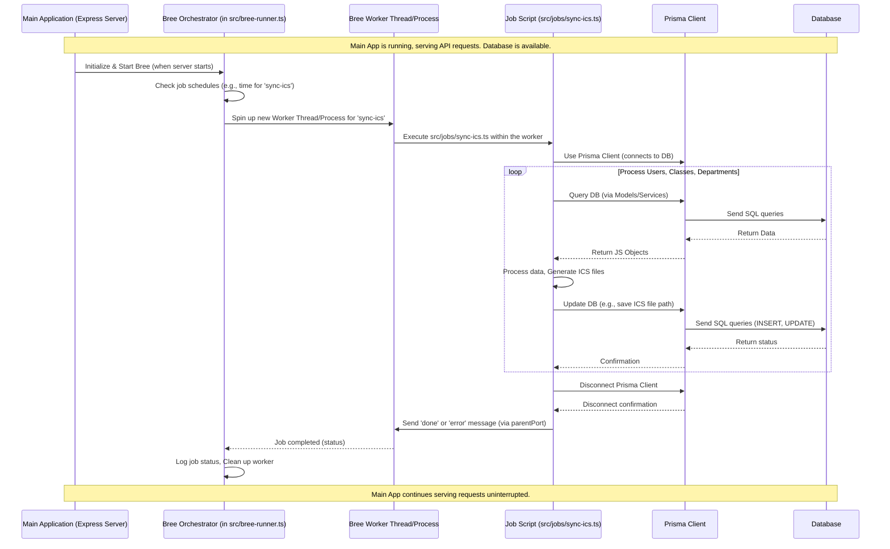

# Chapter 7: Background Task Runner (Bree)

Welcome back! In our last chapter, [External Data Sync](06_external_data_sync_.md), we looked at how our `events-api` gets crucial data from outside sources like the Untis school system and legacy files through dedicated scripts, separate from the main web server request flow. These scripts handle tasks like fetching data periodically or importing large datasets.

But how do we make sure these scripts run automatically at the right time (scheduled tasks) or run in the background without blocking anything else? For instance, syncing Untis data might need to happen every night, or generating hundreds of calendar files based on subscriptions could take a long time. We don't want these long-running or scheduled tasks to interfere with the main application's responsiveness when users make requests via the API.

## The Night Shift Crew

Imagine our API application is like a bustling factory during the day, handling individual customer orders (user requests) quickly. The activities we discussed in previous chapters ([API Web Server (Express.js)](03_api_web_server__express_js__.md), [Request Handlers (Controllers)](05_request_handlers__controllers__.md), [Data Logic (Models)](02_data_logic__models__.md)) are the day shift workers processing these orders immediately.

However, some tasks aren't tied to a specific incoming order, or they take too long to do while a customer waits. These tasks need a dedicated "night shift crew" that works in the background.

These background tasks include:

*   **Scheduled Maintenance:** Like tidying up the database or performing regular backups (though not explicitly in this project's scope, it's a common example).
*   **Periodic Reports/Generation:** Creating reports or files that are needed regularly (like generating calendar files for subscriptions).
*   **Long-Running Processing:** Tasks that handle a large amount of data or take significant computation time (like syncing data from an external system if it's complex or involves fetching many things).

This is where a **Background Task Runner** comes in. It's like the supervisor who manages the night shift crew, telling them *what* to do (*the job*) and *when* to do it (*the schedule*), ensuring they work independently without interrupting the day shift.

## Introducing Bree: Our Night Shift Foreman

In the `events-api` project, we use **Bree** as our background task runner. Bree is designed to run scheduled jobs in separate worker processes or threads. This is important because Node.js applications are typically single-threaded. If a single request handler or script runs a very long task, it blocks *all* other requests and processing. By running jobs in separate workers, the main application thread remains free and responsive.

Think of Bree as the system that kicks off the night shift crew (the jobs) on their own separate machines so they don't take up space or resources on the main factory floor.

Bree allows us to:

1.  **Define Jobs:** Write the specific tasks we want to run in separate script files.
2.  **Schedule Jobs:** Tell Bree *when* to run these jobs (e.g., "every night at 3 AM", "every 6 hours").
3.  **Run Jobs Independently:** Bree starts these job scripts in dedicated worker threads or processes, isolating them from the main application server.

## Our Use Case: Periodically Generating Calendar Files (`sync-ics`)

A key feature of the `events-api` is providing calendar subscriptions in ICS format. These `.ics` files allow users to subscribe to events in external calendar applications (like Google Calendar, Outlook, Apple Calendar). The content of these files needs to be generated based on the current data in our database.

Generating these files for potentially many users, classes, or departments can take time. Moreover, these files need to be updated periodically as events change or new data is synced from Untis. This task is perfect for a background job.

Our use case is: **Generate updated ICS calendar files for users, classes, and departments on a regular schedule.**

In the `events-api`, the task for this is called `sync-ics`.

## How Bree Manages the `sync-ics` Job

Let's see how Bree is configured to run the `sync-ics` job.

Bree's configuration is primarily done in `src/bree-runner.ts`, and the actual job scripts live in the `src/jobs` directory.

### 1. Configuring Bree and Defining the Job (`src\bree-runner.ts`)

This file initializes Bree and tells it which jobs to run and their schedules.

```ts
// Simplified src\bree-runner.ts
import Logger from './utils/logger'; // For logging
import Bree from 'bree'; // The Bree library
import path from 'path'; // Node.js path module

if (process.env.NODE_ENV === 'production' || process.env.BREE) {
    // Create a new Bree instance
    const bree = new Bree({
        logger: Logger, // Use our custom logger
        root: path.join(__dirname, 'jobs'), // Tell Bree where to find job scripts (the 'jobs' directory)
        jobs: [
            // --- Define our 'sync-ics' job ---
            {
                name: 'sync-ics', // The name of the job, corresponds to the file name in 'src/jobs' (sync-ics.ts)
                interval: 'every 6 hours', // How often to run the job
                // This option runs the job once 20 seconds after Bree starts (useful for initial run)
                // date: new Date(Date.now() + 20 * 1000)
            }
        ],
        // This helps Bree find the job file correctly depending on if running raw TS or compiled JS
        defaultExtension: process.env.TS_NODE ? 'ts' : 'js'
    });

    // Listen for Bree events (optional, for logging)
    bree.on('worker created', (name) => { Logger.info(`Bree: worker created for ${name}`); });
    bree.on('worker deleted', (name) => { Logger.info(`Bree: worker deleted for ${name}`); });
    bree.on('worker started', (name) => { Logger.info(`Bree: worker started for ${name}`); }); // Custom log
    bree.on('worker ended', (name) => { Logger.info(`Bree: worker ended for ${name}`); }); // Custom log
    bree.on('worker error', (error, name) => { Logger.error(`Bree: worker error for ${name}`, error); }); // Custom log


    // Start Bree! This checks the schedule and runs jobs when they are due.
    bree.start();
    Logger.info(`Bree started`); // Simplified log
} else if (process.env.NODE_ENV !== 'test') {
     // Log if Bree is not started in development mode
    Logger.info(`Bree not started`); // Simplified log
}
```

**Explanation:**

1.  `new Bree(...)`: Creates an instance of the Bree job runner.
2.  `root: path.join(__dirname, 'jobs')`: This tells Bree to look for job definition files (like `sync-ics.ts`) inside the `src/jobs` directory.
3.  `jobs: [ { name: 'sync-ics', interval: 'every 6 hours' } ]`: This is the crucial part that defines the `sync-ics` job.
    *   `name: 'sync-ics'`: Bree will look for a file named `sync-ics.ts` (or `sync-ics.js` depending on the environment) in the `root` directory. This file contains the actual code for the job.
    *   `interval: 'every 6 hours'`: This tells Bree to schedule this job to run approximately every 6 hours. Bree supports various scheduling options (cron syntax, milliseconds, dates, etc.).
4.  `bree.start()`: This command kicks off the Bree scheduler. Bree will now periodically check the schedule for all defined jobs and run them when it's time.

This configuration ensures that the `sync-ics.ts` script will be automatically executed by Bree every six hours.

### 2. Writing the Job Script (`src\jobs\sync-ics.ts`)

This is the actual code that performs the task of generating ICS files. Bree runs this script in a separate worker thread/process.

```ts
// Simplified src\jobs\sync-ics.ts
// This script is executed by Bree in a separate worker

// worker_threads allows communication with the parent process (Bree)
import { parentPort } from 'worker_threads';
import prisma from '../prisma'; // Our Prisma Client
import Users from '../models/user'; // Our Users Model
// Services that contain the logic for creating ICS files
import { createIcsForClasses, createIcsForDepartments } from '../services/createIcs';
import Logger from '../utils/logger'; // Logger for the job

// The job logic is inside an async immediately-invoked function expression (IIFE)
(async () => {
    Logger.info('sync-ics job started');
    try {
        // --- Task 1: Generate ICS for individual users ---
        const usersWithUntisId = await prisma.user.findMany({
             where: { untisId: { not: null } } // Only sync ICS for users linked to Untis
        });
        Logger.info(`Syncing ICS for ${usersWithUntisId.length} users...`);

        // Loop through users and generate their ICS file
        // The actual code processes in batches for performance
        for (const user of usersWithUntisId) {
             try {
                // Call a function from the Users Model to create the ICS file for the user
                await Users.createIcs(user, user.id);
                 Logger.debug(`Created ics file for user ${user.id}`);
             } catch (err) {
                 Logger.warning(`Error creating ics for user ${user.id}: ${err}`);
             }
        }
        Logger.info('Finished syncing user ICS files.');

        // --- Task 2: Generate ICS for classes ---
        // Call a service function to create ICS files for all classes
        await createIcsForClasses();
        Logger.info('Finished syncing class ICS files.');

        // --- Task 3: Generate ICS for departments ---
        // Call a service function to create ICS files for all departments
        await createIcsForDepartments();
        Logger.info('Finished syncing department ICS files.');


        // Disconnect Prisma client when done in the worker
        await prisma.$disconnect();
        Logger.info('Prisma disconnected');

        // --- Signal completion to Bree ---
        // This is important for Bree to know the job ran successfully
        if (parentPort) {
            parentPort.postMessage('done');
        } else {
             // If running as a standalone script (not via Bree), exit manually
            process.exit(0);
        }

    } catch (err) {
        Logger.error('sync-ics job failed', err);
        // Ensure Prisma is disconnected even on error
         await prisma.$disconnect().catch(logError => Logger.error('Prisma disconnect failed after error', logError));
        // --- Signal error to Bree ---
        if (parentPort) {
            parentPort.postMessage('error');
        } else {
            process.exit(1);
        }
    }
})(); // Execute the async function immediately
```

**Explanation:**

1.  `(async () => { ... })()`: The entire job logic is wrapped in an asynchronous immediately-invoked function. This allows using `await` directly at the top level of the script.
2.  `import prisma from '../prisma';`, `import Users from '../models/user';`, `import { createIcsForClasses, createIcsForDepartments } from '../services/createIcs';`: The job script imports the necessary components to perform its task – our [Prisma](01_database_orm__prisma__.md) client to interact with the database, our [Users Model](02_data_logic__models__.md) (which has the `createIcs` function), and specific service functions responsible for the ICS generation logic (defined in `src/services/createIcs.ts`).
3.  `await prisma.user.findMany(...)`: The job script uses [Prisma](01_database_orm__prisma__.md) to find all users who need an ICS file generated (users linked via `untisId`).
4.  `await Users.createIcs(user, user.id);`: It iterates through the users and calls a function from the [Users Model](02_data_logic__models__.md) (`createIcs`) to handle the complex logic of fetching the user's relevant events and generating the ICS file. This function likely uses [Prisma](01_database_orm__prisma__.md) internally to query events.
5.  `await createIcsForClasses()` and `await createIcsForDepartments()`: These calls delegate the tasks of generating ICS files for classes and departments to dedicated service functions. These functions also interact with the database (via [Prisma](01_database_orm__prisma__.md)) to fetch relevant events.
6.  `await prisma.$disconnect()`: It's good practice for job scripts that use Prisma to explicitly disconnect the Prisma client when the job is finished, freeing up database connections.
7.  `parentPort.postMessage('done');`: If the script is running in a worker thread managed by Bree (`parentPort` will exist), this line sends a message back to Bree indicating that the job completed successfully. Bree uses this to monitor the job status.
8.  `catch (err) { ... parentPort.postMessage('error'); ... }`: Includes error handling. If any error occurs during the job execution, it's logged, Prisma is disconnected, and an 'error' message is sent back to Bree.

This script embodies the background task: it performs database reads ([Prisma](01_database_orm__prisma__.md), [Models](02_data_logic__models__.md)), calls data processing logic (services), and is designed to run independently without waiting for or responding to an HTTP request.

## Under the Hood: Bree and Workers

Let's visualize how Bree runs a job like `sync-ics`.



This diagram shows:

1.  Bree is initialized and started *by* the main application but then runs independently in the background.
2.  When a job is due, Bree doesn't run it in the main application thread. Instead, it creates a *separate* worker.
3.  The actual job script (`sync-ics.ts`) runs inside this dedicated worker.
4.  The job script interacts with [Prisma](01_database_orm__prisma__.md) and the database directly from its worker process.
5.  Critically, the main application thread (handling Express requests) is *not* blocked while the job script runs, even if the job takes a long time.
6.  The worker communicates back to Bree when it's finished, allowing Bree to monitor and manage the jobs.

This isolation prevents long-running tasks like generating many ICS files from making the API unresponsive for users trying to fetch data or perform other quick actions.

## Conclusion

Using a background task runner like Bree is essential for handling tasks that need to run independently of user requests, either on a schedule or because they are long-running. In the `events-api`, Bree manages jobs like `sync-ics`, which periodically generates calendar files. Bree runs these jobs in separate worker processes or threads, ensuring that the main web server thread remains free to handle incoming API requests quickly and efficiently. By defining jobs in the `src/jobs` directory and configuring their schedules in `src/bree-runner.ts`, we offload heavy or time-sensitive tasks from the main application flow.

We've now covered how the API handles incoming requests and interacts with data, as well as how it performs background tasks. But what about times when the server needs to send information *to* a client *without* the client having explicitly asked for it just then? This leads us to real-time communication.

[Next Chapter: Real-time Communication (Socket.IO)](08_real_time_communication__socket_io__.md)

---

Generated by [AI Codebase Knowledge Builder](https://github.com/The-Pocket/Tutorial-Codebase-Knowledge)