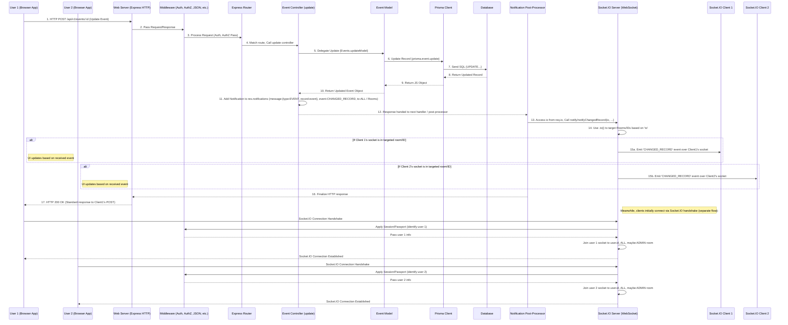

 Chapter 8: Real-time Communication (Socket.IO)

Welcome back! We've covered a lot so far. You know how our `events-api` stores data ([Database ORM (Prisma)](01_database_orm__prisma__.md)), organizes data logic ([Data Logic (Models)](02_data_logic__models__.md)), receives requests ([API Web Server (Express.js)](03_api_web_server__express_js__.md)), secures them ([Access Control (Authentication & Authorization)](04_access_control__authentication___authorization__.md)), handles specific actions via Controllers ([Request Handlers (Controllers)](05_request_handlers__controllers__.md)), and even syncs data automatically from external sources or runs scheduled tasks in the background ([External Data Sync](06_external_data_sync_.md), [Background Task Runner (Bree)](07_background_task_runner__bree__.md)).

All these processes involve the client (like a user's web browser) *asking* the server for information or to perform an action. The server *responds* to that request, and then the connection for that specific request is usually closed.

But what if something changes on the server *after* the client has finished asking questions? Imagine an administrator updates an event that several users are currently viewing, or a background job an administrator started finishes. How do the clients know about these changes without constantly asking the server "Is anything new yet? Is anything new yet?" (a process called "polling")?

This constant asking can be inefficient and slow. We need a way for the server to say: "Hey! Something you care about just changed! Here's the update!" and send it instantly to the relevant client(s).

## The Live News Ticker

Imagine our application is like a news website. The standard API requests are like you refreshing the page to get the latest headlines.

**Real-time Communication** is like having a **live news ticker** at the top of the page. The news source (the server) automatically *pushes* breaking news updates directly to your screen as soon as they happen, without you having to refresh the entire page.

This system allows the server to instantly send updates to users' browsers without them having to constantly ask for new information. When data changes (like an event is updated or a job finishes), the server can *push* that change directly to the clients who need to know.

In our `events-api`, this is used for:

*   Notifying users when an event they are interested in is updated or deleted.
*   Informing users (especially administrators) when a background job (like an import or a sync) changes status or completes.
*   Potentially updating lists or specific UI elements in a connected frontend application without a full page reload.

## Introducing Socket.IO: Our Instant Messenger

To build this live news ticker functionality, our `events-api` uses **Socket.IO**. Socket.IO is a library that enables real-time, bidirectional, event-based communication between the server (Node.js Express application) and the client (like a web browser).

Unlike standard HTTP requests which are short-lived (request-response-close), Socket.IO sets up a **persistent connection** between the client and the server. Think of this as keeping a dedicated phone line open between the two so they can talk back and forth instantly whenever needed.

## Key Concepts of Socket.IO (Simplified)

Socket.IO adds a layer on top of standard web protocols to provide this real-time capability. Here are the basic ideas:

1.  **Sockets:** When a client successfully connects to the Socket.IO server, a "socket" object is created on both the client and the server. This socket represents the open, persistent connection. Each connected client has its own unique socket on the server side.
2.  **Events:** Instead of the HTTP request/response methods (`GET`, `POST`, etc.), communication over a socket happens by sending and receiving custom **events**. The server can `emit` an event (send a message) like `'event:updated'`, and the client can `on` this event (listen for it) to receive the message. The client can also `emit` events for the server to listen `on`. We define the types of events and the data they carry.
3.  **Rooms:** In a real application, you rarely want to send every single update to *every single connected client*. Socket.IO allows you to group sockets into **rooms**. A server can then `emit` a message specifically `to` a certain `room`. This is crucial for efficiently sending updates only to relevant users (e.g., only send admin-specific job status updates to admin-only sockets).

## Setting Up Socket.IO in `events-api` (`src\server.ts`)

The Socket.IO server needs to run alongside our existing Express HTTP server.

Look at the `src/server.ts` file. This is where our Express `app` is created and the standard Node.js HTTP server (`server`) is started, listening on a port. The Socket.IO server is attached to *this same HTTP server* instance.

```ts
// Simplified src\server.ts - Setting up Socket.IO
import app from './app'; // Our Express application instance
import http from 'http';
import Logger from './utils/logger';
import { Server } from 'socket.io'; // Import the Socket.IO Server class
// ... other imports ...
import passport from 'passport'; // Need passport for authentication link
import { Request, Response, NextFunction } from 'express'; // Need Express types for middleware

const PORT = process.env.PORT || 3002;

const server = http.createServer(app); // Create the standard HTTP server using our Express app

// Create a new Socket.IO Server instance and attach it to the HTTP server
const io = new Server(/* Pass the HTTP server */ server, {
    cors: {
        origin: /* ... настроить разрешенные домены CORS ... */,
        credentials: true,
        methods: ['GET', 'POST', 'PUT', 'DELETE'] // Standard HTTP methods (though Socket.IO uses events)
    },
    // ... other Socket.IO options ...
});

// --- Integrate Socket.IO with Express/Passport Session/Auth ---
// Socket.IO connections don't use the same middleware pipeline as HTTP requests directly.
// We need to apply session and passport middleware to the Socket.IO connection handshake
// so we can access `req.user` (the authenticated user) when a socket connects.

// Use the same session middleware instance used by Express
// Needs conversion because Socket.IO and Express middleware types are slightly different
io.use((socket, next) => {
    // 'socket.request' is the underlying HTTP request used for the initial handshake
    // We run express's sessionMiddleware on this request object
    sessionMiddleware(socket.request as Request, {} as Response, next as NextFunction);
    // sessionMiddleware is imported from './app' (see actual file)
});
io.use((socket, next) => {
    // Apply passport initialize/session to the handshake request
    passport.initialize()(socket.request as Request, {} as Response, next as NextFunction);
});
io.use((socket, next) => {
    passport.session()(socket.request as Request, {} as Response, next as NextFunction);
});

// --- Authentication Check for Socket Connections ---
// Only allow authenticated users to establish a Socket.IO connection
io.use((socket, next) => {
    // Check if the user object was attached to the handshake request by passport
    if ((socket.request as any).user) {
        // If authenticated, allow the connection
        next();
    } else {
        // If not authenticated, disconnect the socket with an error
        next(new Error('unauthorized'));
    }
});

// ... Routing logic for Socket.IO events (handled in EventRouter below) ...

// Make the Socket.IO instance accessible to Express request handlers (Controllers)
app.use((req: Request, res, next) => {
    // Attach the `io` instance to the Express request object (`req.io`)
    req.io = io;
    next();
});

// ... start the HTTP server normally ...
server.listen(PORT || 3002, () => {
    Logger.info(`application is running at: http://localhost:${PORT}`);
    Logger.info('Press Ctrl+C to quit.');
});
```

**Explanation:**

1.  `const server = http.createServer(app);`: The standard Node.js HTTP server is created using our Express `app`.
2.  `const io = new Server(server, { ... });`: A new Socket.IO server (`io` instance) is created and linked to the standard `server`. This makes Socket.IO listen on the same port and handle real-time connections alongside standard HTTP requests.
3.  `io.use((socket, next) => { ... })`: These lines apply our existing Express middleware for sessions and Passport authentication to the *handshake request* that initiates a Socket.IO connection. This is crucial because it allows Passport to identify the user associated with the socket connection and attach the `req.user` object, just like with regular HTTP requests.
4.  The final `io.use` block checks if `req.user` exists after the authentication middleware. If not, it means the user isn't logged in, and the socket connection is rejected with an "unauthorized" error. This ensures only authenticated users can stay connected via Socket.IO.
5.  `app.use((req: Request, res, next) => { req.io = io; next(); });`: This middleware is added to the *Express application*. It takes the Socket.IO `io` instance and attaches it to *every* incoming Express `req` object as `req.io`. This makes the `io` instance readily available inside our Request Handlers ([Request Handlers (Controllers)](05_request_handlers__controllers__.md)), so they can easily trigger Socket.IO messages after processing an HTTP request. (The `src/types/express/index.d.ts` file adds the `io?` property to the Express `Request` interface).

So, when a client connects, the Socket.IO server is initiated. It goes through the session/passport middleware, and if authenticated, the connection is established for that user. The `io` object, representing the connected Socket.IO server instance, is then cleverly attached to every subsequent *HTTP* request object (`req`) so that controllers can access it.

## Handling Socket Connections and Rooms (`src\routes\socketEvents.ts`)

When a new client successfully connects via Socket.IO, the server-side socket (`socket`) object is created, and the `io.on('connection', ...)` event handler in `src/routes/socketEvents.ts` is triggered. This is where we perform setup for the new connection, especially joining rooms.

```ts
// Simplified src\routes\socketEvents.ts - Handling Connections and Rooms
import type { User } from '@prisma/client';
import { Server } from 'socket.io';
// ... other imports ...
import { IoRoom } from './socketEvents'; // Define our standard rooms

const EventRouter = (io: Server) => { // Accepts the Socket.IO server instance
    io.on('connection', (socket) => { // This runs whenever a new client connects
        // Access the authenticated user from the handshake request (thanks to middleware in server.ts)
        const user = (socket.request as { user?: User }).user;

        // We already check authentication via middleware, but this makes types clearer
        if (!user) {
            // Should not happen if middleware works, but good safeguard
            return socket.disconnect();
        }

        // --- Join Rooms for this socket ---
        // Join the user's personal room (using their unique ID)
        socket.join(user.id); // Enables sending messages specifically to THIS user

        // Join the 'ALL' room (for messages sent to everyone)
        socket.join(IoRoom.ALL); // Enables sending messages to all connected users

        // If the user is an ADMIN, join the 'ADMIN' room
        if (user.role === 'ADMIN') {
            socket.join(IoRoom.ADMIN); // Enables sending messages only to admins
        }

        // Accessing the Express session ID for other potential uses
        const sid = (socket.request as { sessionID?: string }).sessionID;
        if (sid) {
             socket.join(sid); // Or use session ID if rooms per session are needed
        }


        // --- Define handlers for client-sent socket events (if any) ---
        // Example: client requesting affected lessons for a hypothetical event
        // socket.on(IoEvents.AffectedLessons, async (eventId, semesterId, callback) => { ... });
        // ... more socket.on handlers ...

    });

    // ... handlers for disconnect, error, reconnect events ...
};

export default EventRouter; // Export the router function
```

**Explanation:**

1.  `io.on('connection', (socket) => { ... })`: This is the main event listener for successful new socket connections. The callback function receives the new `socket` object representing the client's connection.
2.  `const user = (socket.request as { user?: User }).user;`: We access the authenticated `user` object that was attached to the original HTTP handshake request object by the passport middleware (set up in `src/server.ts`).
3.  `socket.join(...)`: The core logic here involves calling `socket.join()` to add this specific socket to different rooms.
    *   `socket.join(user.id)`: The socket joins a room named after the user's unique ID. This allows sending messages specifically to this single user (`io.to(user.id).emit(...)`).
    *   `socket.join(IoRoom.ALL)`: Joins a universal room (`IoRoom.ALL` is just a constant defining the string 'all'). Sending to this room (`io.to(IoRoom.ALL).emit(...)`) sends the message to *all* connected clients.
    *   `socket.join(IoRoom.ADMIN)`: If the authenticated user's `role` is 'ADMIN', they also join an admin-specific room. Messages sent `io.to(IoRoom.ADMIN).emit(...)` only go to currently connected administrators.
4.  The `socket.on(...)` calls (commented out in the simplified example, but present in the full file) show how to listen for events *sent by the client* over the socket, allowing for bidirectional communication.

This setup ensures that once a user is authenticated and connected via Socket.IO, their socket is placed into appropriate rooms, making it possible for the server to target notifications efficiently.

## How Controllers Trigger Notifications (`res.notifications`)

Now that the Socket.IO server is running and connections are managed with rooms, how does a specific change in data, triggered by a standard HTTP request, initiate a real-time notification?

This happens in the Request Handlers ([Request Handlers (Controllers)](05_request_handlers__controllers__.md)). After a Controller successfully performs an action that changes data (like updating an event or completing a job), it adds information about the required notification(s) to a special property on the Express response object: `res.notifications`.

This `res.notifications` property is a custom addition to the Express `Response` type in our project (defined in `src/types/express/index.d.ts`). It's an array where Controllers can push notification objects.

Let's look at snippets from Controllers that do this:

```ts
// Simplified snippet from src\controllers\jobs.ts - update function
import { RequestHandler } from 'express';
// ... other imports ...
import { IoEvent, RecordType, Notification } from '../routes/socketEventTypes'; // Import types

const NAME = RecordType.Job; // Constant for the record type

export const update: RequestHandler</* ... */> = async (req, res, next) => {
    try {
        const model = await Jobs.updateModel(req.user!, req.params.id, req.body.data);

        // --- Add notification details to res.notifications ---
        res.notifications = [ // Start an array of notifications
            {
                message: { type: NAME, record: model }, // What the message is about (type and the updated record)
                event: IoEvent.CHANGED_RECORD, // The type of Socket.IO event to emit
                to: /* Determine recipient room/ID based on job data */ getAudience(model) // Who should receive this notification?
            }
        ];
        // ----------------------------------------------------

        res.status(200).json(model); // Send the standard HTTP response
    } catch (e) {
        next(e);
    }
};

// Simplified helper function to determine audience for a job notification
const getAudience = (job: { userId: string; events: any[] /* Simplified */ }) => {
     // If the job affects published events or admin events, send to ADMIN room
    return job.events.some((e) => e.state === 'PUBLISHED' || e.state === 'REVIEW' || e.state === 'REFUSED')
       ? IoRoom.ADMIN // Assume admins care about jobs affecting public/reviewed/refused events
         // Otherwise, send only to the user who started the job
       : job.userId; // Send to the user's specific room
};
```

```ts
// Simplified snippet from src\controllers\events.ts - update function
import { RequestHandler } from 'express';
// ... other imports ...
import { IoEvent, RecordType, Notification } from '../routes/socketEventTypes';

const NAME = RecordType.Event;

export const update: RequestHandler</* ... */> = async (req, res, next) => {
    try {
        const model = await Events.updateModel(req.user!, req.params.id, req.body.data);
        // Logic to get related groups/users happens here...

        // --- Add notification details to res.notifications ---
        res.notifications = [
            {
                message: { type: NAME, record: model }, // The updated event record
                event: IoEvent.CHANGED_RECORD, // The type of Socket.IO event
                to: // Determine recipients based on event state (draft vs published)
                    model.state === 'DRAFT'
                        ? [req.user!.id /* ... and group members */] // Only author/group members for drafts
                        : IoRoom.ALL // All connected users for published events
            }
        ];
        // ----------------------------------------------------

        res.status(200).json(model); // Send the standard HTTP response
    } catch (error) {
      // ... error handling ...
        next(error);
    }
};
```

```ts
// Simplified snippet from src\controllers\departments.ts - destroy function
import { RequestHandler } from 'express';
// ... other imports ...
import { IoEvent, RecordType, Notification } from '../routes/socketEventTypes';
import { IoRoom } from '../routes/socketEvents'; // Import IoRoom

const NAME = RecordType.Department;

export const destroy: RequestHandler<{ id: string }> = async (req, res, next) => {
    try {
        const model = await Departments.destroy(req.user!, req.params.id);

        // --- Add notification details for deletion ---
        res.notifications = [
            {
                message: { type: NAME, id: model.id }, // For deletion, usually just the deleted ID
                event: IoEvent.DELETED_RECORD, // The deletion event type
                to: IoRoom.ALL // Departments are general data, notify all
            }
        ];
        // --------------------------------------------

        res.status(204).send(); // Send the standard HTTP response (No Content for delete)
    } catch (error) {
        next(error);
    }
};
```

**Explanation:**

1.  After the Model operation (e.g., `Jobs.updateModel`, `Events.updateModel`, `Departments.destroy`) is successful, the Controller creates an array of `Notification` objects.
2.  Each object in the `res.notifications` array describes *one* notification to be sent.
3.  `message`: Contains the payload for the Socket.IO message. It includes the `type` of record (`RecordType` enum like `'JOB'`, `'EVENT'`, `'DEPARTMENT'`) and either the full `record` object (for create/update) or just the `id` (for delete).
4.  `event`: Specifies the type of Socket.IO event to be emitted (`IoEvent` enum like `'NEW_RECORD'`, `'CHANGED_RECORD'`, `'DELETED_RECORD'`).
5.  `to`: Crucially, this specifies the target for the message. It can be a single user ID (string) or an `IoRoom` constant (`IoRoom.ALL`, `IoRoom.ADMIN`). This determines *which* sockets (and thus which connected clients) should receive the message. Controllers determine the appropriate recipient(s) based on the context (e.g., event state, job owner).
6.  The standard HTTP response is still sent after setting `res.notifications`. Setting this property does *not* send the Socket.IO message yet.

This pattern allows Controllers to declare *intent* to send notifications without directly interacting with the `io` instance or the complexities of Socket.IO.

## Sending the Socket.IO Messages (`src\routes\notify.ts`)

Okay, Controllers add notifications to `res.notifications`. Who actually *reads* this property and sends the messages over Socket.IO?

This happens in a post-processing step *after* the Controller has finished but *before* the final HTTP response is fully sent back. The `events-api` uses a custom handler for this, likely implemented implicitly as part of the routing or error handling middleware flow, which checks `res.notifications` and uses a helper function to send the messages.

The `src/routes/notify.ts` file contains this helper function that interacts directly with the Socket.IO server instance (`io`).

```ts
// Simplified src\routes\notify.ts - The helper to send messages
/* istanbul ignore file */ // This file is ignored by code coverage because it depends on live Socket.IO

import { Server } from 'socket.io'; // Import Socket.IO Server type
// Import the types for our messages/events
import { ChangedRecord, IoEvent, Notification, RecordType } from './socketEventTypes';

// Helper function to send a specific Socket.IO message
export const notify = (io: Server | undefined, type: IoEvent, payload: Object, to?: string | (string | IoRoom)[]) => {
    if (!io) {
        // Don't do anything if Socket.IO server instance is not available
        return;
    }

    // Handle single recipient or array of recipients
    const recipients = Array.isArray(to) ? to : (to ? [to] : undefined);

    if (recipients) {
        // If specific recipients are defined, emit to each room/ID
        recipients.forEach(roomOrId => {
             io.to(roomOrId).emit(type, payload);
        });
    } else {
        // If no recipient specified, emit to all connected sockets (less common in this app)
        io.emit(type, payload);
    }
};

// Specific helper for the common case of notifying about changed records
export const notifyChangedRecord = (
    io: Server | undefined, // The Socket.IO server instance (we get this from req.io)
    payload: ChangedRecord<RecordType>, // The message payload (type and record)
    to?: string | (string | IoRoom)[] // The recipient(s) (room or user ID)
) => {
    // Call the general notify function with the specific event type
    notify(io, IoEvent.CHANGED_RECORD, payload, to);
};

// Similar helpers exist for NEW_RECORD and DELETED_RECORD events
// ... notifyNewRecord, notifyDeletedRecord ...
```

**Explanation:**

1.  `export const notify = (io: Server | undefined, ...)`: This function takes the Socket.IO `Server` instance (`io`), the `type` of event to emit (from `IoEvent`), the message `payload`, and the target `to` (a room name, user ID, or array of these).
2.  `io.to(roomOrId).emit(type, payload);`: **This is where the message is actually sent!**
    *   `io`: The Socket.IO server instance.
    *   `.to(roomOrId)`: Selects the specific room or individual socket (by ID) that should receive the message.
    *   `.emit(type, payload)`: Sends an event of the specified `type` (e.g., `'CHANGED_RECORD'`) with the given `payload` data to all sockets that are in the selected room(s).
3.  `notifyChangedRecord(...)`: This function is a wrapper around `notify` specifically for the `'CHANGED_RECORD'` event type, making controller code cleaner.

The post-processing step (not shown as a simple snippet, but implied by the structure of `src\routes\router.ts` and `$res.notifications` handler which you can find in the codebase) iterates through the `res.notifications` array *after* the controller finishes its `try` block, retrieves the `io` instance from `req.io`, and calls `notify` or `notifyChangedRecord` for each notification object in the array.

This decouples the notification *trigger* (in the Controller) from the notification *sending* (using the `notify` helper via the `io` instance).

## Under the Hood: The Real-time Flow

Let's put it together and visualize the end-to-end flow when a user modifies an event (and assumes another user is connected via Socket.IO and viewing related data).



This diagram shows that the standard HTTP request flow is used to *trigger* the data change. After the change is made and saved to the DB, the Controller adds the notification request (`res.notifications`). A separate part of the server then uses the `io` instance (made available on `req.io`) and the `notify` helper to send the real-time message over the persistent Socket.IO connections to any relevant clients.

## Conclusion

Real-time communication using Socket.IO is a powerful feature that allows our `events-api` to actively push updates to connected clients whenever important data changes, like event details or job statuses. This avoids inefficient polling and provides a more dynamic and responsive user experience.

Socket.IO runs alongside the Express HTTP server, establishing persistent connections (sockets) with authenticated clients. These sockets are organized into rooms (`IoRoom.ALL`, `IoRoom.ADMIN`, user ID rooms) for targeted messaging. Controllers trigger notifications by adding details to the `res.notifications` property after data changes. A post-processing step reads this property and uses the Socket.IO server instance (`req.io`) and helper functions like `notifyChangedRecord` to `emit` the appropriate events to the relevant rooms, instantly updating connected users.

While Socket.IO handles the technical delivery of real-time messages, these messages are often part of a broader strategy for informing users about changes, which can also include other methods like email. We'll explore this combined notification system in the next chapter.

[Next Chapter: Notifications (Email & Socket.IO)](09_notifications__email___socket_io__.md)

---

Generated by [AI Codebase Knowledge Builder](https://github.com/The-Pocket/Tutorial-Codebase-Knowledge)
