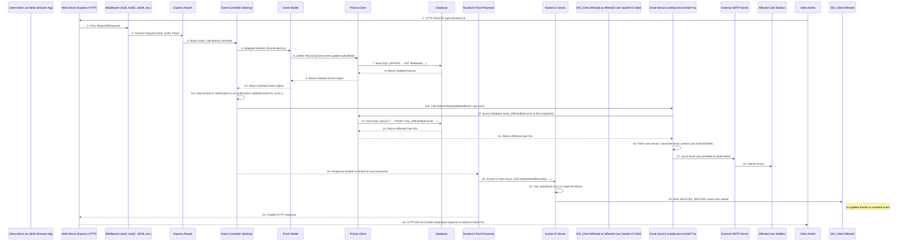

# Chapter 9: Notifications (Email & Socket.IO)

Welcome back! In our previous chapter, [Real-time Communication (Socket.IO)](08_real_time_communication__socket_io__.md), we learned how our `events-api` uses Socket.IO to send instant updates to connected clients, like a live news ticker in a web app. This is great for showing changes right away on a user's screen.

But sometimes, an instant notification isn't enough, or the user might not be online or have the application open. What if an essential event they planned to attend is suddenly cancelled? They need to know about that crucial change reliably, even if they aren't actively looking at the app interface.

This is where a more comprehensive **Notification System** comes in. Its purpose is to inform users about important status changes, updates, or deletions related to events and other relevant data. It acts as the application's built-in communication manager, ensuring relevant people are alerted when something significant happens.

## Not Just a Ticker: A Multi-Channel Alert System

Think of our application managing events. When an event is created, updated, or deleted, or when its review status changes (like from `REVIEW` to `PUBLISHED` or `REFUSED`), different users might need to be informed:

*   The event's author.
*   Users who are affected by the event (e.g., students or teachers whose lessons are impacted).
*   Administrators who need to review events.
*   Users who have subscribed to notifications about event changes.

The best way to reach these different users and provide the right level of detail often requires more than just an in-app message.

Our notification system employs a dual approach:

1.  **Socket.IO Notifications:** For immediate, real-time updates within the connected application interface. This is like the live news ticker we discussed in the last chapter. It's ideal for showing a quick alert or updating a list dynamically.
2.  **Email Notifications:** For external, asynchronous, and often more detailed communication. This is like getting a specific alert email about a major news story. It ensures the user receives the information even if they are offline and provides a persistent record.

This dual strategy ensures that users are informed effectively, meeting both the need for instant feedback while using the app and reliable notification even when they aren't.

## Our Use Case: Notifying Users When an Event is Deleted

Let's consider the scenario where an administrator deletes a published event.

*   The connected web application needs to know immediately so it can remove the event from any lists the user is viewing.
*   Users who were potentially affected by this event (e.g., those listed as attendees or whose timetable was impacted) should receive an email explaining that the event is cancelled.

This requires triggering *both* a Socket.IO message *and* targeted emails for the same underlying data change.

## Triggering Notifications from the Controller

The notification process starts in the **Request Handlers (Controllers)** ([Request Handlers (Controllers)](05_request_handlers__controllers__.md)). After a Controller successfully performs an action that modifies data (like deleting an event via the Model), it decides which notifications are necessary.

In the `events-api`, Controllers handle this by:

1.  **Setting `res.notifications`:** Adding objects to this special property on the Express response to signal that Socket.IO notifications should be sent. This is primarily for real-time updates to connected clients.
2.  **Directly Calling Notification Services:** Invoking specific functions from notification service modules (like `src/services/notifications/notifyUsers.ts`) to send emails.

Let's revisit a simplified example of the `destroy` function in `src/controllers/events.ts` and see how it triggers both:

```ts
// Simplified snippet from src\controllers\events.ts - destroy function
import { RequestHandler } from 'express';
// ... other imports ...
import Events from '../models/event'; // Import the Events Model
// Import types for Socket.IO notifications
import { IoEvent, RecordType, Notification } from '../routes/socketEventTypes';
import { IoRoom } from '../routes/socketEvents'; // Import rooms
// Import service function for email notifications
import { notifyOnDelete } from '../services/notifications/notifyUsers';


const NAME = RecordType.Event; // Define type of record for notifications

export const destroy: RequestHandler<{ id: string }> = async (req, res, next) => {
    try {
        // 1. Delegate the core task to the Model (deletes the event in the DB)
        const deletedEvent = await Events.destroy(req.user!, req.params.id);

        // Only send notifications for non-draft events that were actually deleted
        if (deletedEvent.state !== 'DRAFT' && deletedEvent.deletedAt) {

            // 2a. Add Socket.IO notification details to res.notifications
            // This will trigger a real-time message to connected clients
            res.notifications = [
                { // This object tells the Socket.IO post-processor what to send
                    message: { type: NAME, id: deletedEvent.id }, // Message payload: record type and ID
                    event: IoEvent.DELETED_RECORD, // Socket.IO event type
                    to: IoRoom.ALL // Send to all connected clients in the 'ALL' room
                }
            ];

            // 2b. Directly call the email notification service
            // This function handles identifying relevant users and sending emails
            await notifyOnDelete(deletedEvent, req.user!);
        }


        // 3. Send the standard HTTP response
        res.status(204).send(); // 204 No Content is typical for successful deletion

    } catch (error) {
        // Pass any errors to the error handling middleware
        next(error);
    }
};
```

**Explanation:**

1.  The controller calls `Events.destroy` on the [Model](02_data_logic__models__.md) to perform the database operation.
2.  After successful deletion, it checks if notifications are needed (i.e., if the deleted event wasn't a draft and is marked as deleted).
3.  `res.notifications = [...]`: An array is assigned to `res.notifications`. This array contains objects structured according to the `Notification` interface (defined in `src/routes/socketEventTypes.ts`). This specific notification object tells the system to emit a `DELETED_RECORD` Socket.IO event with the event's type and ID, targeted at the `IoRoom.ALL` (all connected clients).
4.  `await notifyOnDelete(deletedEvent, req.user!);`: The controller directly calls the `notifyOnDelete` function from `src/services/notifications/notifyUsers.ts`. This function is specifically designed to handle the logic for sending emails when an event is deleted. It receives the details of the `deletedEvent` and the `actor` (the user who initiated the deletion) as arguments.

This split approach allows `res.notifications` to act as a simple declaration for real-time events processed generically later, while dedicated email services (`notifyOnDelete`, `notifyOnUpdate`, etc.) contain the complex logic needed for email recipients and content.

## Sending Socket.IO Notifications (Recap)

As covered in the [Real-time Communication (Socket.IO)](08_real_time_communication__socket_io__.md) chapter, a dedicated post-processing step (middleware or handler after the controller) looks for the `res.notifications` property. If found, it iterates through the array and uses the `io` instance (which was attached to `req.io` in `src/server.ts`) and helper functions (like `notify` or `notifyDeletedRecord` from `src/routes/notify.ts`) to emit the specified Socket.IO events to the defined recipients (`to` field).

This ensures that as soon as the HTTP request finishes processing (and before the final response is sent back), connected clients get the real-time updates.

## Sending Email Notifications

Email notifications have a more complex flow because they involve external communication and require looking up user email addresses and potentially generating detailed content.

### 1. Identifying Recipients and Content Logic (`src\services\notifications\notifyUsers.ts`)

The service functions called directly by controllers (like `notifyOnDelete`, `notifyOnUpdate`, `notifyOnReviewRequest`, `notifyOnRefused`, `mailOnAccept` - used within `notifyOnUpdate`) contain the main logic for emails:

*   **Who to email?** This involves querying the database to find relevant users based on factors like:
    *   Are they marked to receive notifications (`notifyOnEventUpdate` field on `User` model)?
    *   Are they affected by the event change (using the `view_AffectedByEvents` Prisma view, which links users/classes/departments to events)?
    *   Are they administrators (based on `Role`) and have enabled relevant admin notifications (`notifyAdminOnReviewRequest`, `notifyAdminOnReviewDecision`)?
    *   Are they the author of the event?
*   **What to email?** This logic determines the subject line, main message, and content of the email, often structured as a table of event details or changes. Different functions generate content tailored to deletion, update, acceptance, refusal, or review requests.

Let's look at a simplified snippet from `src\services\notifications\notifyUsers.ts`:

```ts
// Simplified snippet from src\services\notifications\notifyUsers.ts - notifyOnDelete
import { EventState, User } from '@prisma/client';
import { ApiEvent } from '../../models/event.helpers';
import prisma from '../../prisma'; // Need Prisma to find affected users
// Import specific email sending functions
import { mailOnDelete } from './mail/onDelete';
// ... other imports and validMails fetching ...

export const notifyOnDelete = async (deleted: ApiEvent, actor: User) => {
    // 1. Determine the audience (who needs this email?)
    const affected = await prisma.view_AffectedByEvents.findMany({
        where: {
            eventId: deleted.id
        },
        select: {
            userId: true // Get the IDs of users affected by the deleted event
        },
        distinct: ['userId'] // Ensure unique user IDs
    });

    // Get map of user IDs to emails for relevant locales
    const validMails = await notifiableUsers(); // Function to fetch emails of users interested in notifications

    // 2. Loop through relevant locales (de/fr in this case)
    LOCALES.forEach((locale) => {
        // 3. Filter affected user IDs to get their email addresses for this locale
        const recipientEmails = affected
            .map((e) => validMails[locale].get(e.userId)) // Get email for user ID, results in string | undefined
            .filter((email): email is string => !!email); // Filter out undefined values

        // 4. If there are recipients, call the specific mail sending function
        if (recipientEmails.length > 0) {
             mailOnDelete({ // Calls the function that creates and sends the 'deleted' email
                 deleted: deleted, // Pass the deleted event
                 actor: actor,     // Pass the user who deleted it
                 to: recipientEmails, // List of email addresses
                 locale: locale    // Language for the email
             }); // Note: This is async, but often not awaited here to avoid blocking.
        }
    });
};

// --- Simplified notifyOnUpdate example ---
export const notifyOnUpdate = async (
    events: { event: ApiEvent; previous?: ApiEvent; /* ... */ }[],
    message: string, /* reason for refusal */
    actor: User
) => {
     // ... complex logic here to find which users are newly affected, no longer affected, etc. ...
     // ... uses prisma.view_AffectedByEvents and other queries ...

      // Based on complex logic, build lists of recipients for different types of updates
      // For example, send specific emails for:
      // - Event accepted (to author, possibly affected users) -> calls mailOnAccept
      // - Event refused (to author, admins) -> calls mailOnRefused
      // - Event updated (to affected users who were and still are affected) -> calls mailOnChange with type AFFECTED
      // - Event updated (to users newly affected) -> calls mailOnChange with type AFFECTED_NOW
      // - Event updated (to users no longer affected) -> calls mailOnChange with type AFFECTED_PREVIOUS
      // - Event sent for review (to admins) -> calls mailOnReviewRequest

      // mailOnAccept, mailOnRefused, mailOnChange, mailOnReviewRequest are imported from './mail/*.ts'
     // await mailOnAccept(...)
     // await mailOnRefused(...)
     // await mailOnChange(...)
     // await mailOnChange(...)
     // await mailOnChange(...)
     // await mailOnReviewRequest(...)

     // All these functions internally call sendMail
};

// ... other notification logic (e.g., notifyOnAccept, notifyOnRefused, notifyOnReviewRequest)...
```

**Explanation:**

1.  `notifyOnDelete` and `notifyOnUpdate` and similar functions in `src/services/notifications/notifyUsers.ts` are the central points for deciding *who* gets an email and *what type* of email based on the event change and the user base.
2.  They use [Prisma](01_database_orm__prisma__.md) (e.g., `prisma.view_AffectedByEvents.findMany`) to query the database and find the relevant users.
3.  They fetch the email addresses for these users, often filtering based on language/locale and the user's notification preferences (`notifyOnEventUpdate`, `notifyAdminOnReviewRequest`, etc.).
4.  They then call specific email generation and sending functions (like `mailOnDelete`, `mailOnChange`, `mailOnAccept`, etc., imported from `src/services/notifications/mail/*.ts`), passing the event details, the actor, recipient list, and locale.

### 2. Generating and Sending the Email (`src\services\notifications\mail\*.ts` and `authConfig.ts`)

The functions in `src/services/notifications/mail/` (like `mailOnDelete.ts`, `onChange.ts`, `onAccepted.ts`, `onRefused.ts`, `onReviewRequest.ts`) are responsible for:

*   Formatting the email content using libraries like `mailgen` to create structured HTML emails.
*   Defining the subject line, intro text, and tabular data summarizing the event details or changes.
*   Calling the low-level mail sending function (`sendMail`) with the complete email configuration (sender, recipients, subject, HTML/text body).

The `sendMail` function in `src\services\notifications\mail\authConfig.ts` handles the actual interaction with an external SMTP server (the service that delivers emails) using Nodeemailer:

```ts
// Simplified snippet from src\services\notifications\mail\authConfig.ts
import { createTransport } from 'nodemailer'; // Library for sending emails
import Mail from 'nodemailer/lib/mailer'; // Nodemailer types
import SMTPTransport from 'nodemailer/lib/smtp-transport'; // SMTP transport types

// Configuration for connecting to the email server (uses environment variables)
export const authConfig: Readonly<SMTPTransport.Options> = Object.freeze({
    service: 'edubern365', // Example service name
    host: process.env.MAIL_HOST || '', // Email server address
    // ... other connection details and credentials securely stored in env vars ...
    auth: Object.freeze({
        user: process.env.MAIL_USERNAME || '',
        pass: process.env.MAIL_PASSWORD || ''
    })
});

export const sendMail = async (config: Mail.Options) => {
    if (process.env.NODE_ENV === 'test' /* || !process.env.MAIL_HOST */) {
        // In test/dev without config, simulate success without sending
        console.log('Simulating email send:', config.subject, 'to:', config.to || config.bcc || 'N/A');
        return Promise.resolve(true);
    }

    // 1. Create a Nodemailer transporter instance using the authConfig
    const transporter = createTransport(authConfig);

    // 2. Send the email using the configured transporter and the provided content config
    return transporter.sendMail(config)
        .then((info) => {
            // Log success information
            console.log('Email sent:', info.response);
            return true;
        })
        .catch((err) => {
            // Log and handle errors during sending
            console.error('Error sending email:', err);
            return false;
        });
};
```

**Explanation:**

1.  The `authConfig` object holds the credentials and server details for connecting to the email sending service, loaded from environment variables for security.
2.  `createTransport(authConfig)` creates a "transporter" object, configured with the server details.
3.  `transporter.sendMail(config)` takes the email content configuration (sender, recipients, subject, body, etc.) and attempts to send the email through the external SMTP server.
4.  The function handles promises to manage the asynchronous sending process and includes basic logging and error handling.

The email-specific service functions (`mailOnDelete`, etc.) in `src/services/notifications/mail/` use `mailgen` to generate the HTML and plain text body and then call this `sendMail` function with the compiled content.

## The Complete Notification Flow

Let's visualize the end-to-end notification flow when an administrator deletes a published event.



This diagram illustrates the dual path notifications take:

*   The standard HTTP request triggers the change.
*   The Controller initiates *both* the Socket.IO notification (by setting `res.notifications`) and the Email notification (by directly calling an email service function).
*   The Socket.IO notification is picked up by a separate post-processor and sent via the persistent Socket.IO connections to connected clients.
*   The Email service function finds recipients by querying the DB and then sends the email through an external SMTP server.
*   Both notification types happen concurrently after the database change, ensuring prompt in-app updates and reliable external communication via email.

## Conclusion

The `events-api` provides a robust notification system by combining the speed of real-time Socket.IO messages with the reliability and detail of email. Controllers act as the trigger points, initiating both types of notifications immediately after a significant data change is successfully committed. Socket.IO updates are handled via the `res.notifications` property and a post-processing step, providing instant feedback to connected users. Email notifications are managed by calling dedicated service functions (like those in `src/services/notifications/notifyUsers.ts`) directly from the Controller; these services are responsible for identifying the correct email recipients and generating detailed email content using helper functions and an external mail sending transporter. This multi-channel approach ensures that users are effectively informed about changes that matter to them, supporting a responsive and reliable event management system.


---

Generated by [AI Codebase Knowledge Builder](https://github.com/The-Pocket/Tutorial-Codebase-Knowledge)
