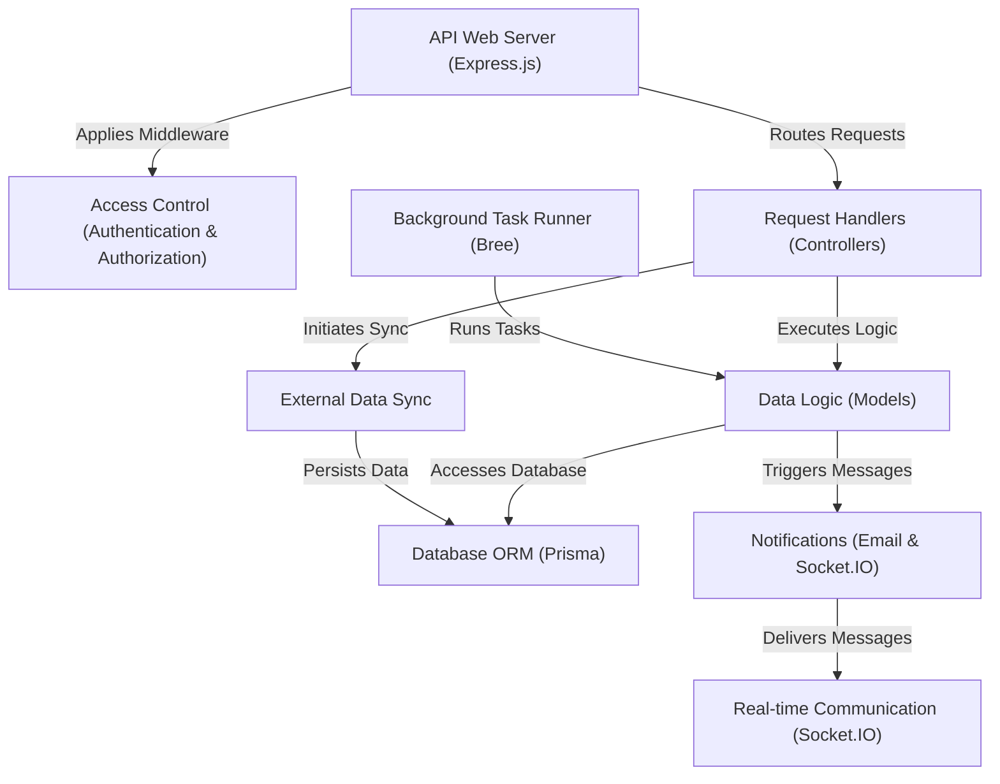

# Tutorial: events-api

This project is an API that *manages* **school events** like timetable changes and appointments. It *syncs* data from **external systems**, stores it in a **database**, and provides access via an **API web server**. It enables **real-time updates** for users and runs **background tasks** like generating calendars. **Access control** ensures security, and **notifications** keep relevant parties informed through email and real-time messages.

**Source Repository:** [events-api](https://github.com/lebalz/events-api)

## Chapters

1. [Database ORM (Prisma)
](01_database_orm__prisma__.md)
2. [Data Logic (Models)
](02_data_logic__models__.md)
3. [API Web Server (Express.js)
](03_api_web_server__express_js__.md)
4. [Access Control (Authentication & Authorization)
](04_access_control__authentication___authorization__.md)
5. [Request Handlers (Controllers)
](05_request_handlers__controllers__.md)
6. [External Data Sync
](06_external_data_sync_.md)
7. [Background Task Runner (Bree)
](07_background_task_runner__bree__.md)
8. [Real-time Communication (Socket.IO)
](08_real_time_communication__socket_io__.md)
9. [Notifications (Email & Socket.IO)
](09_notifications__email___socket_io__.md)

---

Generated by [AI Codebase Knowledge Builder](https://github.com/The-Pocket/Tutorial-Codebase-Knowledge)
