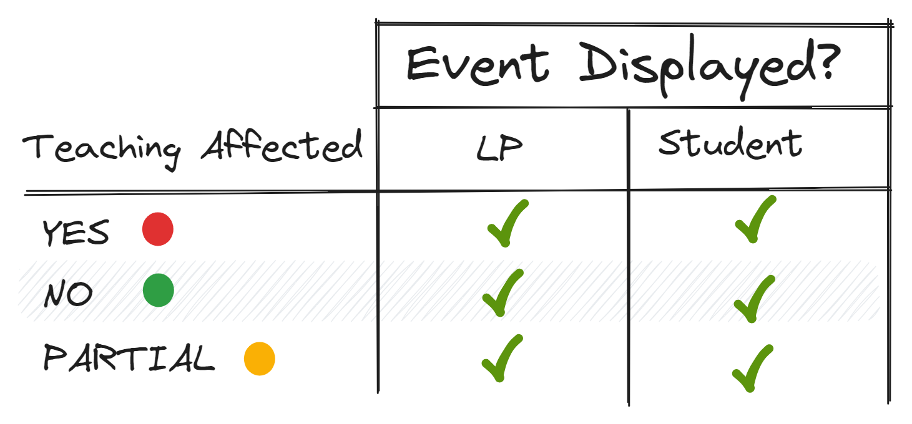

# Events

## Audience

## Teaching Affected

This is only used to determine wheter a lesson takes place or not.
- `TeachingAffected.YES`: The lesson can not be taught.
- `TeachingAffected.NO`: The lesson can be taught.
- `TeachingAffected.PARTIAL`: The lesson can be taught, but not all students are present.

