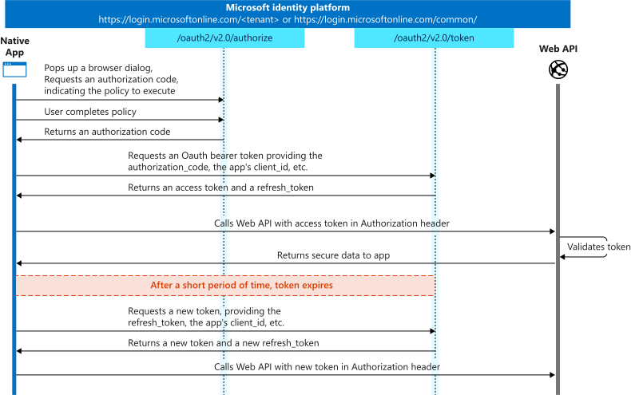

# User Authentication

The authentication is handled by Azure AD with an OAuth 2.0 authorization code flw ([see for more details](https://learn.microsoft.com/en-us/azure/active-directory/develop/v2-oauth2-auth-code-flow)).

