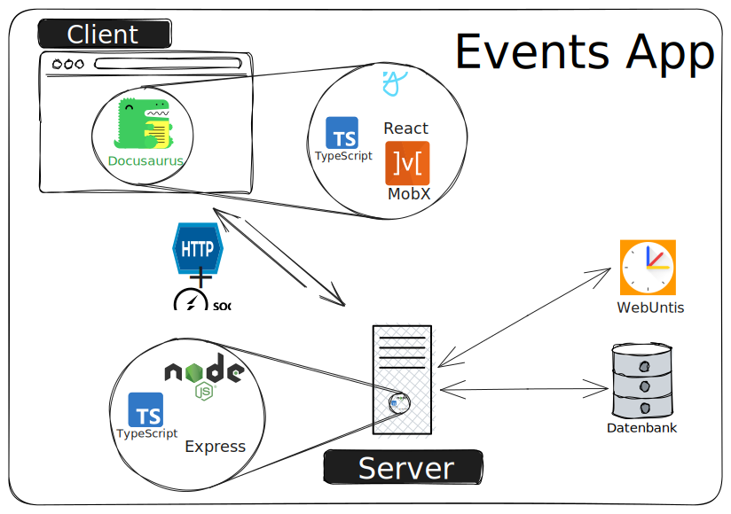

# Events App

## Architecture

### Technology

#### Client Side

- [Docusaurus](https://docusaurus.io/) - a modern Documentation Framework
- [React](https://react.dev/) a library to create interfaces and components
- [TypeScript](https://www.typescriptlang.org/) - a typing system for type-safety
- [MobX](https://mobx.js.org/README.html) a state management library. Stores keep data and it's modification and ensures, the client is updated.
- [Axios](https://axios-http.com/docs/intro) HTTP Client for Browsers

#### Server Side
- [Node JS](https://nodejs.org/) JavaScript runtime
- [TypeScript](https://www.typescriptlang.org/) - a typing system for type-safety
- [Express JS](https://expressjs.com/) Fast, lightweight web framework for Node JS

#### Client Server Communication Protocols
- HTTP Protocol for API calls to the server
- Websockets (through [SocketIO](https://socket.io/)) for a permanent connection between the server and the client. Ensures all connected clients are kept synced.

